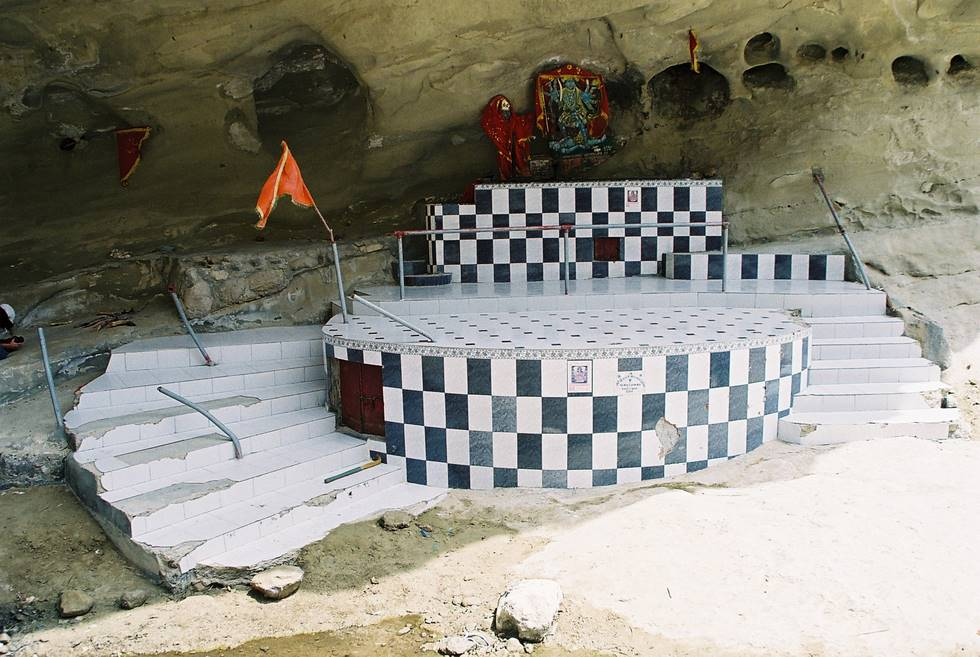

On the way to the main shrine/temple.

## Comments (2)

**KARAM TALPUR** - December 29, 2008  2:11 PM

CAN SOMEONE PLEASE GUIDE ME THE WAY UP TO NANI MANDAR. WHAT IS HINGLAG AND WHAT HAS ITS RELATION WITH HIGOL RIVER. IS IT SAME THING OR DIFFERENT. I WANT TO SEE THESE MAGNIFICIENT PLACES. I AM A NATURE LOVER.MY CELL NO IS 0301-5990234

---

**Masrul** - April 28, 2012  2:44 PM

HAHAHAHAHAHHAHAHA WOW Reallyyyyyy mature. As**** ******** I assmue? Or someone just like her (which may even be worse than actually being her ) I'm glad you find so much humor in making fun of other people. Whatever makes you feel better, honey.

---

