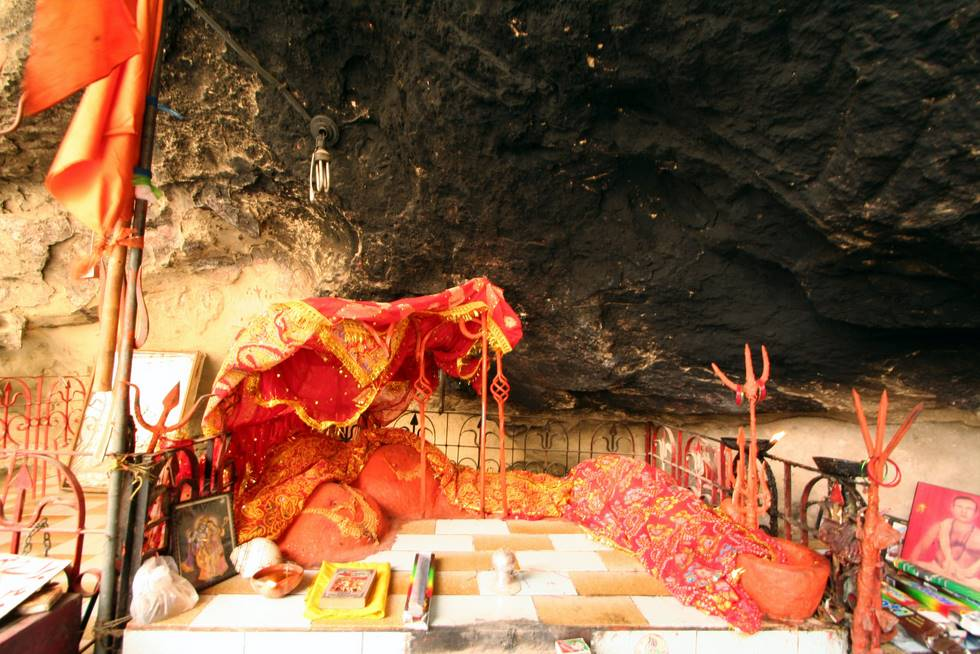

Inside one of the main temples at Hinglach. This is a picture of an idol of Goddess Durga. Hinglaj Mata is one of 52 known shaktipeeths.

## Comments (50)

**gautam gohil** - November 25, 2005 11:46 AM

These are some great pixs thanks for the same. I am from India, and I am really thrilled to see
Hindu Goddess Ma Hinglaj on this site. For more info, there is a similar Hinglaj temple in Gujarat.

Gautam Gohil.

---

**Chinmay Deshpande** - February  2, 2006  9:59 AM

Hello dear friends

I am Chinmay Deshpande from Bhopal , India. This is picture of idol of Goddess Durga.
Hinglaj Mata is one of 52 known shaktipeeths , after partition this region became un accessable to Indians as it went in Pakistan. For more information about Hinglaj mata and yatras please visit this website:-

<http://www.hinglajmata.com>

I am delighted to see that people of pakistan have maintained this lone hindu temple in the region and saved it from destruction by religious fanatics. Infact this is perfect example that common man of both countries India & Pakistan want peace.
Hats off to people of pakistan for their generosity and maintaining such a beautiful site.
Thanks to the people who have given me the opportunity to view this Hinglaj Mata Temple. Indeed you guys have enjoyed the long journey.

May Goddess Hinglaj mata bless you all.

---

**shivraj** - February 11, 2006  2:04 PM

jai hinraj maa
i stay in kenya and im from shree vanza hittechhu mandal
i would like to visit the shakti pith with some bhakts thus would like you to help me with some details
shivraj paresh madhavji jethwa
p.o.box 81384
mombasa
kenya

---

**Chinmay Deshpande** - February 21, 2006  9:07 PM

Dear Shivraj

I don't have any information regarding schedules of yatras so i can not help you in this matter , however you can visit to the following website <http://www.hinglajmata.com> , u can contact to conecerned person there.

Thank You

---

**Ramesh BHANUSHALI** - May 30, 2006  4:13 PM

I Ramesh LILADHAR BHANUSHALI belong to THE KUTCHHI BHANUSHALI community. MAA HINGLAJ is our KULDEVI.
We have grand temples of MATA at all our key community properties. One is in Naliya, Tal. Abdasa, Kutch, Gujarat.INDIA another is at BHANUSHALI WADI, GHATKOPAR, MUMBAI, INDIA. The darshan of MATA is the most pious activity for us and the yatra to its "Mulsthan" is the greatest of all yatras. I hope that the travelling permissions are relaxed and so that everybody can afford to travel to this TEMPLE.

JAI MAA HINGLAJ

---

**bankim chandra** - December 17, 2006 12:30 PM

GREAT JOB GUYS..ITS WONDERFULL TO SEE THAT IN PAKISTAN A HINDU HAS POSTED THE PIC OF MATA JI .IT IS REALLY IMPORTANT TO RESPECT THE CULTURE OF BOTH THE RELIGIONS BECOUSE WE NO LANGER STAY IN THE TIME OF GHAURI OR ASHOKA...the temple looks more like mata vaishno devis temple in katra..thanks ...

---

**vijay** - December 27, 2006  4:06 PM

i dont have any information of hingalaj maa so send me your responce i live in karachi

---

**RAM BABURAO CHAVAN** - August 22, 2007  3:47 PM

Jai Mata Di.
Jai Hinglaj Mata Ki.
I live in Jalna, Maharashtra(I). If any additional information about higlaj Mata. pl. send us.

---

**PURUSHOTHAM RAO** - August 24, 2007  2:09 PM

IS HINGLAJ MATA CONNECTED WITH BHAVA SARA KSHATRIYAS CASTE LOCATED IN SOUTH INDIA
OR PARASURAM RISHI CONNECTED WITH BHAVASARA KSHATRIYAS

---

**JIgar Patel** - August 31, 2007  2:49 PM

Please Can you send me the original photo Of Hinglaj MA situated at Bulichistan

---

**prakash(ompuri)** - October  9, 2007  6:58 AM

plz send me photo higlaj maa
Email :rockay_raj@yahoo.com

---

**manoj dwivedi** - October 12, 2007 11:54 AM

Jai Mata Di. I seen it and lost in its devine beauti

---

**Priya** - November 14, 2007 10:31 PM

Jai MataRani Ki!!!! I am from Pakistan staying in USA and most of my relatives have visited Hinglaj. Every year during Chetichand the bhakts organize the pilgrimage through SwamiNarayan temple in Karachi. I dont have their telephone number right now. I shall arrange to get the number and forward it to whoever is interestred.

---

**dinesh chandra bhanushali** - February 11, 2008 12:07 PM

Hinglaj Mataji is Bhanushali community's Kuldevi, having temples at Nailya, Shirva, Ghatkopar, Mata No madh etc..

---

**Ramchandra P Khatri** - February 23, 2008  4:39 PM

Hi guys,

I belong to the cast BrahmKshatriya , Maa Hinglaj is our KulDevi. Just for the knowledge, We were originally the Kshatriyas but named BrahmKshatriyas after that HINGLAJ MATA has saved whole of the Kshatriya community form a Brahmin named Parshuram, who was on a mission to kill all Kshatriyas on earth. Because of injustice spread by Kshatriya Rajas (Kings) of those times (A long story).

A few of Kshatriyas remained on earth as Parshuram has killed the most, and Kshatriyas took thier way to HINGLAJ MATA to be rescued. HINGLAJ MATA ordered Parshuram to stop killing Kshatriyas , Parshuram agreed but told MATA that he has sworn to make the earth Kshatriya-less , and those words could not be lied, so MATA renamed Kshatriyas to BrahmKshatriyas on that place only. This is how we have been called BrahmKshatriya there after. Generally called Khatri Now a days.

Ramchandra P. Khatri
(2d animator & ActionScript programmer)
AHMEDABAD , GUJARAT.
INDIA.
rpkhatri.ind@gmail.com

---

**Ratanlal Barot** - April 15, 2008  3:09 PM

Jai Mata Ji,

I feel proud that my uncle aged 75 from Sindhodi-Kutch has been granted visa for visiting the sacred place. I had a word with him and he shared with me his experience regarding how he had to convince the man in the consulate to grant him visa.

It was really a touching moment when he explained that why he wanted to visit this sacred place to the man who interviewed him for the visa. The man after hearing his answer promptly said to him (my uncle) that he need not worry and he has been granted visa.

---

**SANJAY TRIVEDI** - May  1, 2008  3:21 PM

i am impressed with your work. i ever heard about MAA HINGLAG's temple, but didn't know any thingh about it. it is the dream place i have to visit once. the information provided by your site will help me much more, infact your site has motivated me to visit MAA's place. THANKES. MAA bless you. in future if you have any more information about this HOLY YATRA kindly inform me.
with a lot of thanks....

---

**ashok adepal** - June  6, 2008  7:34 PM

Jay HINGLAJ MATA

---

**Hari Rajan Durgia** - June 22, 2008  4:52 PM

*Jai Mata Di*

Thanks to the person for ever who uploaded this page n Idol of Maa. I'm residing in Punjab, INDIA but Maa it's your love n blessings upon me to let me view your Highness out there. I'm Kamboj Hindu as in this planet n Maa you know each n every thing about me n all of your kids. So, Kindly make a way for me so that I can come physically nearer to you. Maa! Maa!! Maa!!! I love you n I know you love me uncountable multiple times more than mine. So, hurry up Maa n make a kind call for me at your holy place out there in Pakistan.
Kindly post more n more images n information details of Maa to my e-mail. TYvm. May Maa Bless u n me n all her kids for ever.
*Jai Mata Di*

---

**Anup Kumar Biswas** - June 23, 2008 12:35 PM

Jay Marutirtha Hinlaj Mata Shaki Peeth
after seen the exvcellent Photographs of Hinlaj devi Shkti Peeth, Distt Makran of South west of Baluchisthan Province , Pakisthan , I also interested , if Hinlaj Devi Mata call, " ie Bulawa from Devi Darbar " there , I like get this oppertunity to visit that place .Please communicate ,how to visit that Holy place of our nebouring country ,what are formalities is required , Get Visa of Pakisthan to visit mat Hinlaj Devi in group . The ifomatiom , which i have , its generally takes place inbetween 15 th April and May 1st week every year (During "Chayita Month Navratri days" . Please inform any organisation , who coducting this yatra from Mumai Ahemdabad or Rajkot (Junagarh ), I can also join them to vist this great holy place.

---

**shilpa tejura/vithlani** - July 15, 2008  7:23 PM

JAI MATAJI

---

**sanjiv bhati** - August 21, 2008  8:50 PM

jai mata hinglaj devi its like a dream comes true maa hinglaj bless me and all those who has faith in maa

---

**Jigar Masharuwala** - October  2, 2008  1:04 AM

I felt very nice by visiting this site,amazing...I m khatri and I would like to know about our gotra...also want to know that what is different between khatri and vanza khatri??? plz guide me...

---

**prem** - October  6, 2008  2:42 PM

jai maa HINGLAJ.

---

**prem** - October  6, 2008  2:50 PM

jai maa HINGLAJ.

---

**Sireesha** - October  8, 2008  5:24 PM

Jai maa Hinglaj.

Cannot tell you how important this day is in my life.

Got online darshan of mata HInglaj of Pakistan.
Through this email, my friends, I want to share with you a well known fact.
Mata Durga in all her forms blesses her children thoroughly.
Especially if you fast and pray during Navratras.

My application for an Australian VISA was lodged in the year 2002 with the process which is usually 12 months long prolongigin to 2 yaers and finally got rejected.

I was very close to Maa durga right from the start but did not know how to pray according to exact rites and rituals.

When I actually relocated to PUnjab, I started doing Navratras well and this Navratras on the ninth day MATA SIDDHI DATRI has made the IMPOSSIBLE POSSIBLE.

After 6 years when I and my family and my consultant had almost lost hopes, our visa is garnted and in a week's time I will be recieving my stamped visa whicxh is a permamnenet resident VISA to Australia.

One of my biggest dreams come true.

Mata rani is present , she is much aware of our dreams...she sees, feels and touches you. She cries when you are sad and makes the path of your life smooth for you....hey hey she punishes you if you do wrong so that you can realize your mistake ask for forgiveness and learn!

Jai maa Vaishno ki.Jai maa chintpurni ki.
Jai Mata HINGLAJ KI.

May your glory spread may people know you better.
get your blessings.

Please keep faith on her.

There is delay but no failure!!!

---

**RAJKUMAR GADHAVI** - October 17, 2008  5:56 PM

jai ma hingalaja,a to sarva shrestha raja,mari maat hingalaja.

hii friends, I belong to Charan community.It is said that AAI HINGALAJ was born in my community thus we are called "DEVI PUTRA" from ancient times.Also AAI AAVAD,AAI KARNI were born in our community.Its a glory that i am born in such a community great.It is said herself calls for charans in navratra. MAA is omni present. read DEVIYAAN by ISHARDAN BARHAT.

---

**Saksham** - February 28, 2009 10:15 PM

Saadar Parnaam Mai Hinglaj, watch the below Videos on Mata Hinglaj Ji.

<http://www.youtube.com/watch?v=2rTxpsTgKJ4>
<http://www.youtube.com/watch?v=w-UaginpkVg>
<http://www.youtube.com/watch?v=_QcBPDafSKs>

Jai Mata Ji.

---

**HARDIK NAVIN DHERAI** - March  6, 2009 10:59 PM

HINGLAJ MAA HAMARE PARIVAR KE KUL DEVI MATA HAI.
"JAI HINGLAJ MAA"
"KOTI KOTI PRANAM"
"JAI HINGLAJMAA"

---

**Shah Farhan MAK Jalali** - March 23, 2009 11:38 PM

By the way this is general information of Hindu Community members from INDIA and overseas,the pictures on this site were taken and posted by proud Muslim Pakistanis.The group you saw in the series of Photograph are all Muslims.Being Muslim we are more open to Religious tolerance.We got big heart to tolerate hindu Temples and the idols of hindu dieties although those things are in direct confrontation of Islamic teachings.I read a lot about Hinduism those are only mythology and hearsay nothing to substatiate those tales.Look into the Buddhaism it is also very OLD religion yet lot of things of the religion can be physically proved.Any way open your mind and heart and Read about Islam and then compare between TRUTH and MYTHOLOGY.Do continue to believe in Hinduism but at the same time think with Logic.

---

**sunil singh** - March 30, 2009 11:11 PM

our kuldevi is hinglajmata, it is hard for us to go in pakisthan. so i want to know other temples of hinglajmata in india so i could take blessing of mata

---

**Deepak Rajput** - April  3, 2009 12:38 PM

Dear Sir/Madam
Can you give me address of Hinglaj Mata Mandir In Rajastan.

Thaking You.

---

**Mukesh Goswami** - June 12, 2009  4:23 PM

Nice photograph....Thanks for putting this photo of our Kuldevi Hingalaj Mataji...Thanks a lot...

---

**shailesh gala** - July 18, 2009  8:01 PM

Jai mat ji. god bless you. plz send me photo Shree Higlaj Maa. shail2109@gmail.com.

---

**Rohan** - September 16, 2009  5:17 PM

Maa Hinglaj is our Gramdevta
my villege have one hinglaj tempal
Please Can you send me the original photo Of Hinglaj MA situated at Bulichistan

---

**Sejal** - September 18, 2009 10:41 PM

Pls can someone tell me the best way to get to hinglaj ma temple from india. Is there any tours companys from India that do this tour?

---

**rajesh samor** - September 24, 2009  8:09 PM

Dear All
Jai Mataji Ki

I belongs to the 'Charan' community and Mataji is our ancestor, thats why we are called 'Deviputra' also. there are a very few mandir of mataji are in India. We Charans greatly thankfull by heart to the noble people who are taking care of this temple. There is a ancient temple of mataji is there in Delhi (Naraina Area) if anyone need more details related to Mataji or Charans pls mail me at: rajeshsamor@gmail.com

Maa aap sab ka bhalaa karain!

---

**gaurav khatri** - October  4, 2009 11:08 PM

Jai mata di . god bless you. plz send me photo Shree Higlaj Maa.
Pls can someone tell me the best way to get to hinglaj ma temple from india. Is there any tours companys from India that do this tour?

---

**Raju Dangar** - October  8, 2009 11:36 PM

Jay mataji to all
jay maa hinglaj

---

**Rajvrat Gadhvi** - October  8, 2009 11:40 PM

jay mataji to all,
jay maa hinglaj we pray to hinglaj that our drem's come true to once come in her darbar in life jay mata rani ki.

---

**varad** - October 13, 2009 10:42 PM

Jai mata di . god bless you. plz send me photo Shree Higlaj Maa.
Pls can someone tell me the best way to get to hinglaj ma temple from india. Is there any tours companys from India that do this tour?

---

**mahesh** - November  5, 2009 11:38 AM

jai mata hinlaj dhanay ha wo log jo mata ka darshan kar nay jatay ha or mata jinhe chatee ha woh log hi darshan ko jatay ha bol shree hinlaj mata
ki jai
from,karachi,pakistan

---

**Deepak** - December 29, 2009 10:51 AM

Please send me other photos of Maa Hinglaj

---

**Lekhraj Khatri** - October  4, 2010  4:09 PM

Dear All,

Blessing of Maa HINGLAJ MATAJI decided to construct a temple in SURAT,GUJARAT

now all HINGLAJ Bhakt are welcome for there advise and opinion for start work trustee , committee.

waiting for your valuable comments.

JAI HINGLAJ

LEKHRAJ BHOOT

GOD BLESS YOU

---

**dilipkumar kaku** - March  5, 2011  8:57 PM

JAI MATA HINGALAJ
I THANKS TO ALL THERE IS NO WORD TO SAY I AM TOO LET

---

**Manoj Bhawsar** - April 14, 2011  1:38 PM

Jai Maa Hinglaj. Please can you send me the original photo of Maa Hinglaj situated at baluchistan [Pakistan] on my e-mail address bhawsarmanojdharampuri@rediffmail.com

---

**Sattwata Das** - April 27, 2011  7:35 PM

JAI MATA HINGLAJ...I WANT TO GO TO YOUR PLACE...BLESS ME AND ALL OF US...

---

**satej khadse** - June 17, 2011  2:54 PM

I AM BHAWSAR KSHATRIYA FROM GOA ,INDIA , OUR SAMAJ GODDES IS HINGULAMBIKA , THANKS FOR THIS INFORMATION AND PHOTOGRAPHS .

---

**vivek giri** - July 13, 2011  3:20 PM

our kuldevi is hinglajmata .I want more information about migration of our forfathers from pakistan to india.

---

**Raj** - September 26, 2011 10:36 AM

j mataji

---

