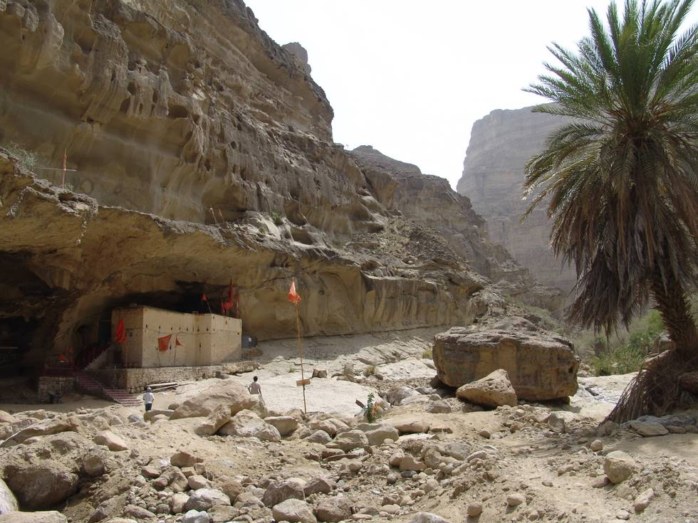

The walk to the temple is through a rocky and mostly dry river bed.

## Comments (4)

**jankam** - March 15, 2008  6:11 PM

Dear all; would you allow me to print above picture as an illustration of my Ph.D. study of Rajasthani gods and goddesses (including Hinglaj), to be printed at Amsterdam University Press in June? I cannot offer any renumeration, but will advertise your website and, if you would be interested, can send you my book.
Thanking you in advance, Janet Kamphorts, Netherlands

---

**hamid omar** - June  4, 2008  2:33 AM

jankum - sure go ahead and use the photograph - there are many more on the offroad site - you could use those too! Rgds. Ho

---

**Engr. PRINCE RAJPAL** - August 13, 2008  1:24 PM

Mata Hinlaj Mandir is situated at Balouchistan Province of Pakistan @ Karachi-Gwadar Highway at Aghor Point. Nearby 250 Km from Karachi and 30 Km from Aghore Point into the mountains. Hinglaj Shewa Associations in different cities of Pakistan are working to promote this holy place for foreign pilgrams also. This place darshan take a more value than Haridwaar in Hinduism Believers. Best months of visit are December to April. If anyone wants to visit this Holy Place, Then come to Karachi at Swami Narayan Temple, Karachi. 24 Hour service available to go to Hinglaj in Private or Rental Vehicle. You can e-mail me to guide u more or can ask any quetion relating to Hinglaj Yatra. ( pmrajpal@yahoo.com )

---

**Ferhat** - April 28, 2012 11:31 AM

DhonnobadKi korbo ja fog hocche kicuhtei bhalo kichu pacchi na . maa kaali bolchi chesta korechi . aaro korbo kichu din wait koro dekhi ki paai

---

