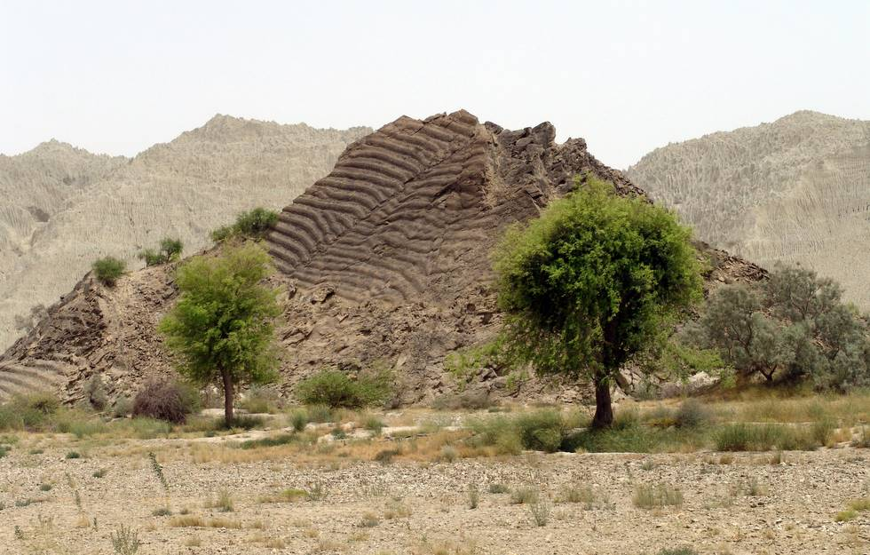

The remains of a fossilized sea bed.

## Comments (6)

**Amir** - August  1, 2005  3:52 PM

I find it rather strange that on the peaks of the earth one can find remains of SEA beddings.......can anyone explain ?

**KO** - August  1, 2005  6:40 PM

The sea used to cover them. For more on this, [see Wikipedia](http://en.wikipedia.org/wiki/Geologic_timescale).

**Imad** - August  2, 2005  1:21 PM

Oceans are always changing shape. Since we humans have been around for only a cosmic blink of an eye, we can't see these things happening. What is now under the sea might some day be thousands of feet above sea level. The volcanoes of Hawai contain fossils of ancient sea creatures!. Cataclysmic events cause land upheaval just as normal tectonic plate movement is causing the Himalyas to grow about an inch in height every year. It's all part of the life cycle of a planet. Don't be so surprised!

**hameed** - August  2, 2005  8:38 PM

goddamn! this little hill is an acid trip in itself...

**Rekha** - January 26, 2006  1:49 AM

Thank you. My hand was heal by someone who prayed this Goddess. I was reading about this person's Guru Kinaram who left his body in Varanasi. I Got interested in this Shrine.

**Ramendra Singh Bhadauria(Astrologer)** - August 30, 2006  2:10 AM

Mata Rani Hinglaj ki Jay,there are 51 parts of Matarani,when Dakchh Jagay destroyed by Kartveerayarjun,then Shivji,hang body of Sati on his solder,and started Tandava in all over world.The part Hing+Laj,Hing means buttocks,and Laj means Part of lady those always covered by cloth.This lahari on mountains is Hawa lahari,seeing as the the lahari of water,and we sense there was sea.

