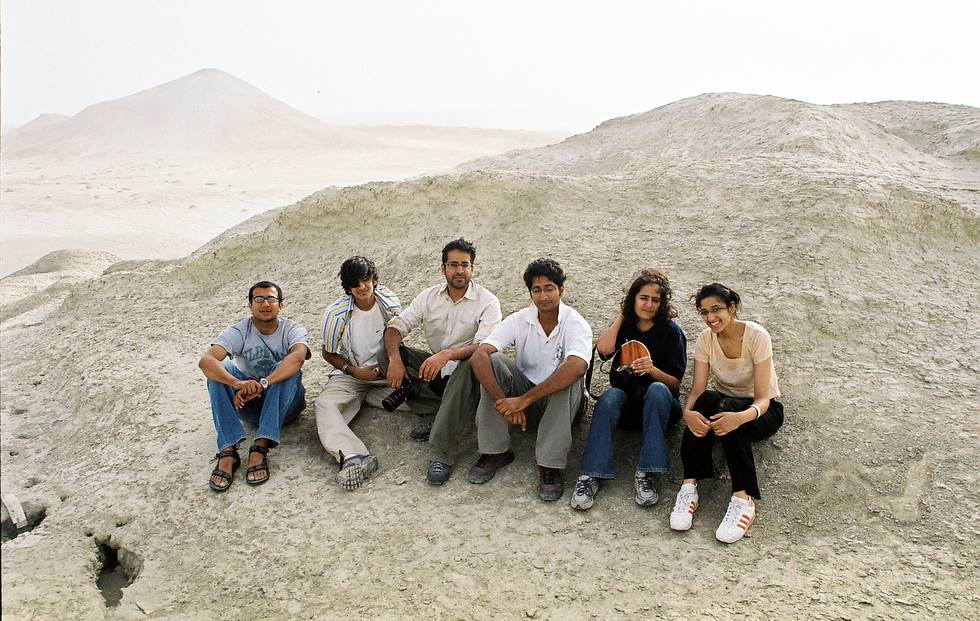

Sheltering from the storm.

## Comments (7)

**bhavsarketank** - May 18, 2008  4:30 PM

jai mataji,i prouad of me beacuse i am bhavsar,i live in india gujarat surat chalthan village but i not go to hingraj mata temple & you are all go on this temple visit wel dun bhavsar

---

**ali akhter** - May 19, 2008 10:03 PM

hi my name is ali akhter from pakistan iam fonding this sites so beautiful your pictures

---

**Zeshan** - June 20, 2008  2:25 PM

Hi I am Shan from KHI
Last month I had visited NANI mander and was amazed and it was due to ur website I was encouraged

---

**Paul Auckland** - October 22, 2008 12:25 AM

plz send me all information and all original photos of temple and allgods especially hinglaj mata.

---

**Ram** - October 23, 2008  2:10 AM

Paul!

I have recently visited in 2007 end. Do you want pics. reply to me at dalaramb@yahoo.com

---

**shameem Ghori** - May  8, 2009  2:19 PM

you people are 4x4 I am 1x1 motorcylest.most of the places of balochistan and sindh I have visited on 1x1. I love these places and love those who love these pak homeland places. I hereby kiss your hands with love.I cant describe my joy to see you people sitting here far from the hustle bustle busy life of cities.those who adopt such ways are always remain keep off from all the addictive things.I pray for all of you.You are the young generation of my country. love to all.Dr.Shameem uddin Ghori

---

**meeena** - March  1, 2010  4:37 PM

hmm lucky people am from kolkata india my grandparents where frm karachi pakistan. Am feeling sooooooo jealous of u all visiting the hinglal temple i always want to visit. nice pics pal........

---

