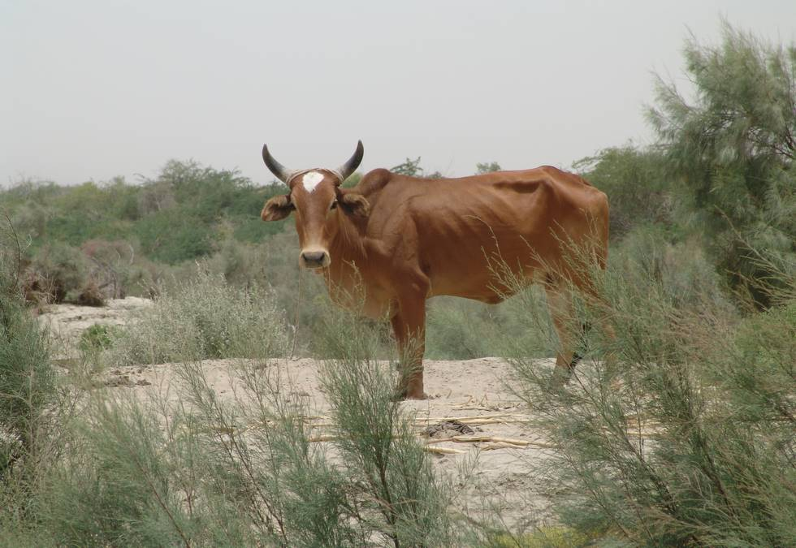

A solitary cow just off the turning to Nani Mandar.

## Comments (4)

**american bulldog** - November 26, 2007  2:08 PM

<http://american-singles5795.lookera.net>

---

**CLEMENTINA** - November 26, 2007  4:18 PM

<http://car-loan272.lookera.net>

---

**CHERRYL** - November 27, 2007  2:56 PM

<http://dedmoroz.qyber.info/80891.html>

---

**Vergie Everson** - December 19, 2011 12:22 AM

The imminence of a ratings decision by S&P may explain why France has sought to deflect attention by lashing out against Britain, claiming the UK's financial position is weaker than its own. Last week the Bank of France suggested the credit rating agencies train their fire on London, even though there seems no imminent danger of Britain losing its premier rating.

---

