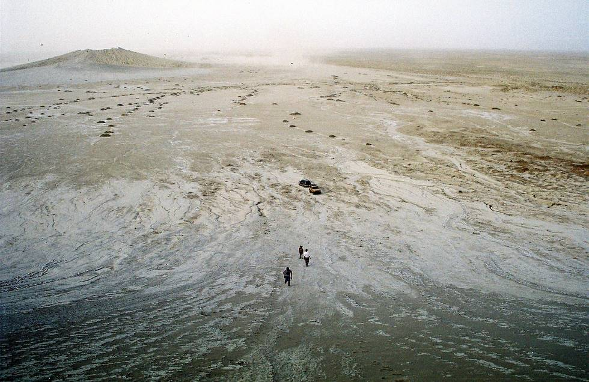

Looking down from halfway up the bigger mud volcanoe.

## Comments (2)

**shahab91** - December 23, 2005 11:32 AM

good pic , can you plese tell me how far this volcanoe from ( nani munder brige costel haighway )

**hamid omar** - June  4, 2008  2:55 AM

the track going to the mud volcanoes is exactly 35km from the Hingol Bridge (toward Karachi direction) From main road turn off, the distance would be another 10 or 15km.

