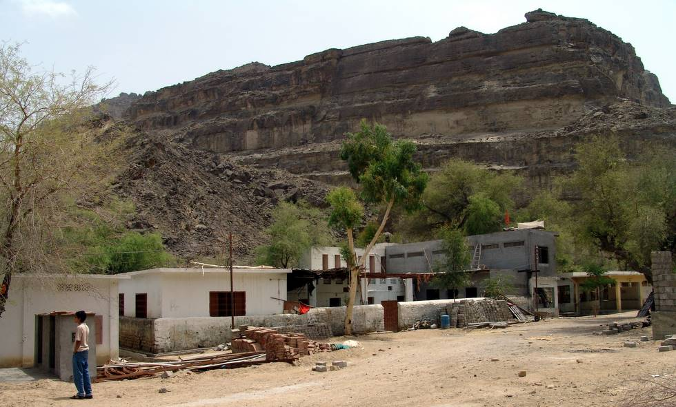

This is what greets one upon arriving at Mata Hinglaj. The main temples are from 15 minutes to 45 minutes walk from here.

## Comments (50)

**B. GHOSH** - December  9, 2005  4:47 PM

REQUIRE SOME PICTURE OF MATA HINGLUJ. WANT TO BECOME A MEMBER OF THIS HOLY PLACE.

---

**Ayan Mondal** - December 12, 2005  3:00 PM

Plz let me know how to get there in Hinglaz temple, and where to stay? Is the place safe for hindus now a days? what are the visa requirements?

---

**tauseef** - February 11, 2006 12:17 PM

believe me//// its superb//// hindus visiting pakistani temples/// n places of worship//// thnx a lot to musharraf n vajapi govt.///n offcourse the new manmohan govt
its love....love...love ///all over love ///the essence of love///peace n harmony has engullfed the subcontinent///
may God almighty let this love flourish more..more....and more

---

**m.m.joshi** - February 20, 2006  5:18 AM

I was amazed to know about a shakti peeth which was laid barren by the slaughter of partition. but i always have a faith in the power of mata that the people who live around ( whose forefathers at some ancient time would have reverred the Mata) are still blessed. I earnestly desire to visit the Mata.

---

**Jayanta Banerjee** - February 27, 2006  5:28 PM

Plz let me know how to go there in Hinglaz temple, and where to stay/cost etc? Is the place safe for hindus now a days? what are the visa requirements?

---

**Vinit** - March 10, 2006 12:40 PM

Please give me the details of Journey & required documents.

Vinit

---

**Taimur Mirza** - March 11, 2006 10:51 AM

Back in 1986 while looking through the map of Balochistan I came across a name written in Old English Script "Sri Mata Hinglaj". Imagining it to be a small village with a scenic touch alongside the river with the Temple being the focal point I asked Hamid Omar and Fasih Khan to visit this place.
Contrary to my imagination the Temple, then only a raised platform about 3 feet high with two small enterances on either side creating a room with three feet high cieling, the platform was open from three sides while the fourth joined the base of the mountain and the figure of Mata on top with a baby cot alongside with other objects of religious importance. This was neatly built in the depression of a 1000 feet high mountain with a stream running in front through lush green vegetation in the narrow valley.
The construction visible in this picture and more on the other side have been made during the second half of 90's and even the Temple platform itself has now been enclosed in a room and not visible anymore.
More on this soon.....

---

**VIRAM MAHESHWARI** - June  6, 2006 11:41 AM

Back in 2006 while looking through the map of Balochistan I came across a name written in Old English Script "Sri Mata Hinglaj". Imagining it to be a small village with a scenic touch alongside the river with the Temple being the focal point I asked Hamid Omar and Fasih Khan to visit this place.
Contrary to my imagination the Temple, then only a raised platform about 3 feet high with two small enterances on either side creating a room with three feet high cieling, the platform was open from three sides while the fourth joined the base of the mountain and the figure of Mata on top with a baby cot alongside with other objects of religious importance. This was neatly built in the depression of a 1000 feet high mountain with a stream running in front through lush green vegetation in the narrow valley.
The construction visible in this picture and more on the other side have been made during the second half of 90's and even the Temple platform itself has now been enclosed in a room and not visible anymore.
More on this soon.....

---

**Imran** - June 19, 2006  8:09 AM

I'm glad to see that the majority of Pakistanis are not fanatics but respectful of other beliefs.
The above place seems to be one to visit and inshallah i'll do my best to one day be their.

---

**Ishan Kundu** - September 25, 2006  4:51 PM

I am from West Bengal, India. Anyone kindly help for getting a week's Pak pilgrimage visa from N.Delhi embassy which is the foremost problem. Others known to me also need it. I have a lifetime wish to see the holy shrine of Mataji along with my family. I intended for it long back but couldn't do so due to lack of information and connection. Whoever is trying to organise a trip in 2007 kindly respond. Why don't we join his hands ! If the trip has to be a little economic, we all can travel by rail through Rajasthan by the newly opened Munnabao - Khokhrapar line (THAR EXPRESS)and then towards Karachi via Mirpur Khas by Pakrail.
All this after getting a Visa which is a real problem.Please keep contact by e-mail : ishankundu@yahoo.co.uk

---

**jayesh tataria** - November  9, 2006  6:36 PM

i am bhramakhstriya from mumbai,india. hinglagdevi is kuldevi of our caste, we pray here. but my dream is to visit once in while baluchisthan, i dont know how , so please guide any one

---

**AP CHOUDHURY** - January 16, 2007  4:04 PM

Sir,
I shall be very happy if you kindly let me know how to visit Mata Peet at Hinglaz.

---

**Manoj Shethia** - March 19, 2007  3:52 PM

Hello,
* I am from Gujarat, India.
* I have a lifetime wish to see the holy shrine of Mataji Hingalaj along with my family.
* Is there any arrangement for stay or we have to choose near city for stay.Where exactly Maa hingalaj temple located and can you guide to reach there if we land at Khokhrapar line.
* I intended for it long back but couldn't do so due to lack of information and connection. Whoever is trying to organise a trip in 2007 kindly respond.
* Why don't we join his hands ! If the trip has to be a little economic, we all can travel by rail through Rajasthan by the newly opened Munnabao - Khokhrapar line (THAR EXPRESS)and then towards Karachi via Mirpur Khas by Pakrail.
* All this after getting a Visa which is a real problem.

Heartly thank ful if you could please helpful to us in this matter.

Thanks.

---

**Ayan Mondal** - September  4, 2007 10:27 AM

Hi, I am from Calcutta & now living in Bangalore. Will there be any journey to hinglaj from india in 2008? Plz let me know. Thanks in advance.

Regards,
Ayan.

---

**Haresh** - October  8, 2007 10:00 PM

hi,I am Haresh from KARACHI PAKISTAN.
i visited Hinglaj Mata more than 15 times but i cant forgot my last yatra in the annual festival(yatra) arranged by HINGLAJ SHEWA MANDLI on 8-12 april 2007. more than 20,000 people came this year, which is double of the last year.
If anybody want any information about HINGLAJ MATA can visit this website www.hinglajmata.com this is HINGLAJ SHEWA MANDLI's original website
and my email id is haresh1000us@yahoo.com & haresh_dewani@hotmail.com
and anybody want to see HINGLAJ's pictures visit this www.pawspakistan.org/forums/viewtopic.php?pid=675

---

**dr pravin khatri** - November 19, 2007  4:39 PM

please furnish me details for fulfilling my lifetime wish for darshan of our kuldevi MA HINGLAJ. AND ALSO HOW TO GET VIZA FROM MUMBAI OR DELHI AND ALSO THE ROUTE FROM MUNNABAO TO KHOKHARAPAR TO KARACHI AT YOU EARLIEST AND URGENTLY
THANK YOU
JAI HINGLAJ
PRAVIN KHATRI

NOTE THAT I AM FROM GUJARAT INDIA
MY PHONE IS 091-79 26765244

---

**PRAVINKHATRI** - November 19, 2007  4:44 PM

please ans my q.
how to reach via munnabao to khokharapar to karachi
and how to have darshan of mata hinglaj
thank you
pravinkhatri ahmedabad gujarat india

---

**anil abhange** - February 27, 2008  5:31 PM

we want to visit the site with my 35 friends pls let me know the proper person who conducts tour

---

**anant mhaske** - February 28, 2008  7:23 PM

pls let us know how to reach for darshan who is tour operator, pls guide us immediataly
so we can take decision fast
rgds
anant

---

**AMRIT PRAJAPATI** - April 29, 2008  6:44 PM

am from Gujarat, India.
* I have a lifetime wish to see the holy shrine of Mataji Hingalaj along with my family.
* Is there any arrangement for stay or we have to choose near city for stay.Where exactly Maa hingalaj temple located and can you guide to reach there if we land at delhi by samjota express
I intended for it long back but couldn't do so due to lack of information and connection. Whoever is trying to organise a trip in 2008 kindly respond.
If the trip has to be a little economic, we all can travel by rail through delhi by samjota express

---

**sivadasan** - May 19, 2008  3:33 PM

It is my life ambition to visit Hindu temples in Baluchistan, Sindh and Punjab. Also I wanted to interract with the Pak Hindus.I am from Kerala, India.
Could you please help me

Sivadasan K

---

**Pawan Surolia** - May 29, 2008  2:16 PM

Suddenly I opened the goggle & got ful details of Mata Hinglaj. To saw these I surprised that temple of Mata Ji in pakistan.

I was became very anxious & I want to see the temple of Maa Hinglaj, kindly let us give the entire details.

---

**DEEPAK TANEJA** - June  6, 2008  2:43 PM

Even I want to visit Mata Hinglaj & Katasraj. My forefathers were based in West Punjab and migrated to India during partition. I visited Lahore for watching cricket match but since both govt. give city based visa I could not visit any other place. People are excellent and hospitality superb.

---

**JAYDEVSINH VAGHELA** - June 29, 2008  2:12 PM

i want to saw this holy place please send some photographs of this holy place to my email id. i from kutch gujarat and hinglaj mataji is divine goddess of many rajput community in rajashthan and gujarat i really interesting to know about the place

---

**Engr. PRINCE RAJPAL** - August 13, 2008  1:20 PM

Mata Hinlaj Mandir is situated at Balouchistan Province of Pakistan @ Karachi-Gwadar Highway at Aghor Point. Nearby 250 Km from Karachi and 30 Km from Aghore Point into the mountains. Hinglaj Shewa Associations in different cities of Pakistan are working to promote this holy place for foreign pilgrams also. This place darshan take a more value than Haridwaar in Hinduism Believers. Best months of visit are December to April. If anyone wants to visit this Holy Place, Then come to Karachi at Swami Narayan Temple, Karachi. 24 Hour service available to go to Hinglaj in Private or Rental Vehicle. You can e-mail me to guide u more or can ask any quetion relating to Hinglaj Yatra. ( pmrajpal@yahoo.com )

---

**prem** - August 13, 2008  2:34 PM

jai kuldevi shri deshnok KARNI MATAJI . Jai HINGLAJ MATAJI . I want to know more about higlaj mataji. once in life i want to come here . mata ki kripa sada hum per bani rahe. ***** JAI HINGLAJ MATAJI*****

---

**Manoj Charan** - October 17, 2008  4:47 PM

Thanks for all of it. this is marvless & holy.

---

**Ram** - October 23, 2008  1:36 AM

Hey you people can visit this site for more

Me from Balochistan Pakistan and have visited lot of times there since the time when we were reaching there in 15 days after crossing all the obstacles now we can go through same route within 4-5 hours.
<http://www.hinglajmatamandir.com/>

---

**VEER** - November 24, 2008  2:29 PM

Back in 2006 while looking through the map of Balochistan I came across a name written in Old English Script "Sri Mata Hinglaj". Imagining it to be a small village with a scenic touch alongside the river with the Temple being the focal point I asked Hamid Omar and Fasih Khan to visit this place.
Contrary to my imagination the Temple, then only a raised platform about 3 feet high with two small enterances on either side creating a room with three feet high cieling, the platform was open from three sides while the fourth joined the base of the mountain and the figure of Mata on top with a baby cot alongside with other objects of religious importance. This was neatly built in the depression of a 1000 feet high mountain with a stream running in front through lush green vegetation in the narrow valley.
The construction visible in this picture and more on the other side have been made during the second half of 90's and even the Temple platform itself has now been enclosed in a room and not visible anymore.
More on this soon.....

---

**Hamid Omar** - November 25, 2008 12:52 AM

DEAR ALL INTERESTED IN VISITING "SRI MATA HINGLACH",

FOR ALL AND ANY INFORMATION YOU NEED, PLEASE GET IN TOUCH WITH MR. JAY SHAH. HE HAS BEEN TO THE TEMPLES AND WOULD SURELY BE GLAD TO SHARE HIS EXPERIENCE! HIS EMAIL:
jayanu@gmail.com

---

**Hamid Omar** - November 25, 2008  1:06 AM

DEAR ALL INTERESTED IN VISITING "SRI MATA HINGLACH",

FOR ALL AND ANY INFORMATION YOU NEED, PLEASE GET IN TOUCH WITH MR. JAY SHAH! HE HAS BEEN TO THE TEMPLE AND WOULD SURELY BE GLAD TO REPLY ABOUT IT! HIS EMAIL:
jayanu@gmail.com

---

**Adeel** - November 25, 2008  4:48 PM

This is the longest thread I've seen on this forum.

---

**AnilSingh** - December  1, 2008  3:16 PM

how does get to the main temple from hyderabad,india

---

**Raghuvir singh charan** - December  2, 2008 10:19 AM

This is very good place .....i want some picture from there plz send me on my Email Address ...........

---

**md iqbal sultan** - January 14, 2009  7:30 PM

i am a research scholar of calcutta university ( india). i want to know details about present sacred route( maps) to holy hinglaj and tourism development

---

**rajesh dave** - March 12, 2009  2:53 PM

i am having a wish to visit Maa Hinglaj temple once in a life time. Hope godess full fill my visit.

Jai maa Hinglaj.

---

**fraz** - March 21, 2009  3:00 AM

i am working on a video for the festival. just came back from a tour and will be traveling with the pilgrims in april.

---

**Naresh Khatri** - June 13, 2009 11:29 AM

Jai MATA ge Ki

How can be part of Hinglaj Shewa Mandali......

---

**pranav dave** - August 27, 2009  5:13 PM

MAA HINGLAJ is our KULDEVI, so here in gujrat there is a tmple of Shri Hinglajmataji at Sidhdhapur Nr. Mehsan. So we visited there often but my wish is to go at MUL STHANAK OF MATAJI AT PAKISTAN, so plz if u have any idea for this holy journey u have plz let me inform on my mail address.
JAY MAA HINGLAJ

---

**PRANAV DAVE** - August 27, 2009  5:28 PM

Jay HINGLAJ MAA
THERE IS SOME SPELLING MISTAKES IN LAST COMMENT THAT A TEMPLE IS NEAR MEHSANA(GUJRAT).
ONE MORE THING TO SHARE WITH MY BROTHERS THAT AMONG ALL 52 SHAKTIPEETHS HINGLAJ AND AMBAJI ARE ON THE TOP AS WHEN THE PARTS OF BODY OF SATIMAT CUT AND FELL ALL OVER THE MOUNTAINS.. THE HEAD-first main part of body fell at pakistan n its known as first SHAKTIPEETH SHREE HINGLAJ MATAJI and THE HEART-another main part of body fell on GABBAR at Danta in Banaskantha district Gujrat N its known as SHAKTIPEETH AMBAJI.....most of us hindus visited Ambaji many times in our lifes as it is very easy to go there so it is popular..BUT MAA HINGLAJ STHANAK AT Pakistan is similar important as Ambaji but there r many difficulties to go there but all of us try to convince both governments of India n Pakistan to make easy a journey to MAA HINGLAJ STHANAK...if we cant do that than shame on us because if our mother is out of our reach n after a lon long time if we r not able to see or care her than its a shmeful for all of us...as the mother who give birth us MAA HIGLAJ is the mother of all n she made us so this is my heartly request to all my brothers that think about it pleaze..
JAY MAA HINGLAJ...... OM HINGULE PARAM HINGULE TANU SHAKTI MANUH SHIVE...HINGULAYAI NAMAH....

---

**Samir Kanaiya** - October 12, 2009 11:18 AM

Hi, I am from Rajkot, Gujarat, I have wish to visit at Hingalajmata is our Kuldevi. ( We are Saraswat Brahmin). May I right? If anyone have information about this plz tell .

---

**Ravi Kumar Advocate** - May  7, 2010 12:33 PM

Hello all,
I am from AGRA, India, and want to know about to reach Hinglaj Mata Mandir. What is the cost to get there per person and what is the right time? I also know about Visa formalities. Thanks in advance...

---

**Sanjay Sharma** - May 15, 2010  4:57 PM

Mata Hinglaj Evi is our Kuldevi.Please let me Know how to go to that Shrine.also if possible send some pictures of shrine in my mail ID.Thanks in Advence.

---

**Manoj Charan** - October  6, 2010 12:03 PM

Jai Shri Hinglaj !
Thanks. Thanks for the giving a holly and wonderfull knoladge. I am a charan. Charan's real origine by the Hinglaj. In my cast we belive that when any child born in charan cast, the Hinglaj Mata is awaiting to them. The Hinglaj Mata wants that the every Charan come here and see the holly tample. We also belive that if we reached at this tample we are elegibale to MOKSHA.
My hartly thank for u, not from me but also from every Charan of India & every Charan of world. I want to come to this holly palace, that is my home. Dekhte hai ki ma ki kripa kab hoti hai.
Hum aapke yahan aayen or aap humare yahan. Par pata nahi kyon kuch log nahi chahte ki ye dono Mulk aman-chain se bhai-bhai ki tarah rahe. again thanks for thease. Jai Shri Mataji. Manoj Charan, Ratangarh (Churu) Raj. India.

---

**koushik das** - May 25, 2011 12:29 AM

I am going Mumbai to hinglaj Mata mondir .
Please, send the direction and journey information to hinglaj from Mumbai(INDIA).
what are the visa requirements?

---

**Kesrising M.Jadav** - August 23, 2011 11:12 AM

Hello.........I am from Mithapur(bhal) Gujrat....India ......... Hinglaj mata is our kuldevi. we want to darsan of maa Hinglaj please send many imformation to me. ........Thaks everybody.

---

**RAJESH SHAH** - September 13, 2011  1:30 AM

I AM FROM RAJKOT, AND IAM VAISHAV VANIK- WELL KNOWN BUSINESSMEN OF RAJKOT OUR FACTORY NAME IS RAJMOTI OIL MILL VERY FAMOUS BRAND OF EDIBLE OIL IN GUJARAT NAMED RAJMOTI BRAND GROUNDNUT OIL . IN MY LIFE I HAVE TWO GREAT EXPERIENCE OF MATA HINGLAJ, ONE IS I AM HAVING MATA HINGLAJ "PRASAD" WE CALL IT "TUMBADI" A SHAPE LIKE SHIVALINGA. THIS TUMBADI COMES FROM HINGLAJ MANDIR PAKISTAN IT SELF BUT II WAS GIVEN ME ONE OF SAINT IN MOCHHA HANUMAN TEMPLE NEAR PORBADAR. AND SECOND INCIDENT THAT, I HAVE ORIGINALLY PHOTO WITH ME OF MATAJI, SOMEBODY WHO CAME FROM KARACHI GIVE ME, BY THE WAY NEAR JASDAN WE HAVE ONE PALACE HINGOLE GADH, THIS THE PLACE OF PRINCE JASDAN , , AND THEY WORSHIP HINGLJA MATTA, AND THEY LIGHT UP ONE LAMP ( AKHAND DIVA) FOR HINGLAJ MATTA. I ALREADY VISITED 400 YEARS OLD PLACE VERY WEIL MAINTAINED. I WANT TO TRAVEL THIS PALACE IN PKAISTAN . AS A
GRACE OF MATAJI HINGLAJ ON ME. my mail id is smarttravelsrajkot@yahoo.coin www.smarttravelsrajkot.com. I AM TRAVEL AGENT IN RAJKOT

---

**animesh** - October 16, 2011  2:07 PM

pl. pl. any one help me to visit mata hinglaz.
details about trip.
namasta
my cell no. 09434063529

---

**dhruba** - October 16, 2011  2:24 PM

help me about maa Hinglaz yatra
maatarawines@rediffmail.com

---

**kiran purohit** - April 11, 2012  3:28 AM

Hello...Iam from visala(RAJSTHAN) ple.ple help me I want darshan ma hinglajmataji shaktipit at pakistan.hinglajmataji yours kuldev.ple give me infermation how go there.cell no 09985780513

---

