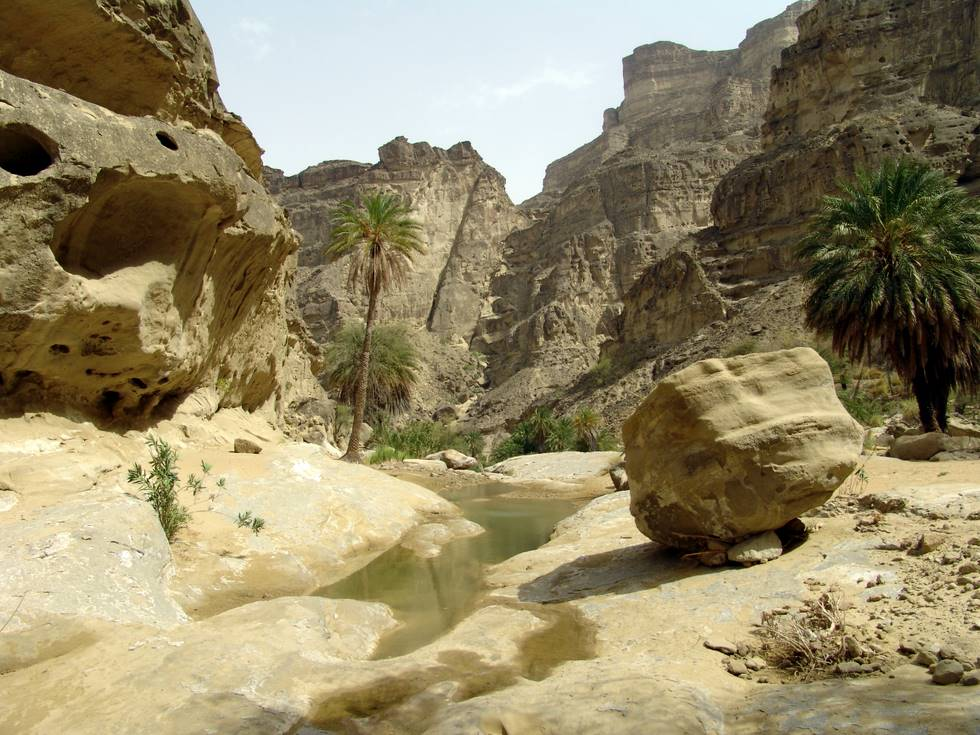

The way to the temples.

## Comments (3)

**Ayan Mondal** - December 14, 2005 10:42 AM

wonderful.... very nice

---

**jankam** - March 15, 2008  6:13 PM

Dear all; would you allow me to print above picture as an illustration of my Ph.D. study of Rajasthani gods and goddesses (including Hinglaj), to be printed at Amsterdam University Press in June? I cannot offer any renumeration, but will advertise your website and, if you would be interested, can send you my book.
Thanking you in advance, Janet Kamphorts, Netherlands

---

**hamid omar** - June  4, 2008  2:42 AM

jankam - pl go ahead and use the pictures! All pictures are in a downloadable format! Regds. Ho

---

