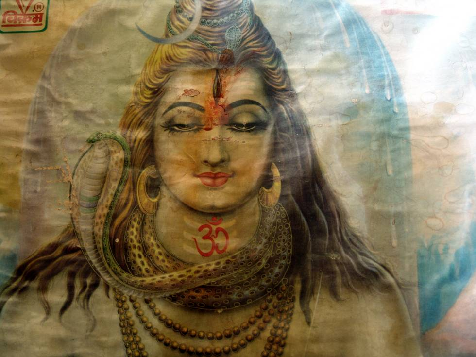

## Comments (8)

**manish sharma** - August  8, 2005  7:42 AM

Painting of Lord " Shiva".

---

**dane ramkissoon** - February 25, 2006  8:35 AM

this is one of the best paintings of lord shiva i have ever seen and it is truly magnificent

---

**marthand** - July 21, 2006  4:05 PM

hara hara mahadeva sambho sankara.....very nice picture.....

---

**bhargav** - August 25, 2006  5:27 PM

every picture of the lord is great. May lord protect all of us. Om Namaha Shivaya.

---

**santhosh sivan** - October  2, 2010  5:03 PM

Aham bhremmasmi

---

**santo mahe** - December  7, 2010  2:13 PM

om namah shivay
har har mahadev shivji

---

**giridharan** - December  8, 2010  8:55 PM

AYAM BRAMAASHMI AGAM BRAMAASHMI............
HE IS WORLD'S OLDEST GOD
THE DESTROYER
NOBODY CAN MATCH HIM
HE IS MY PRIDE
THE ULTIMATE POWER
BELIEVE HIM TRULY,
FOR SURE,
YOU WILL SEE THE CHANGE FROM THE VERY NEXT SECOND
JENMA KARMA SAMEY DHIVYAM
YEVAM YOVAY THITHRATH THAHA
PADMA DEGAM PUNAR JENMA
SATYAP PRABAVAM
DHIVYA PRAKASHAM
BADRA THOROOBAM
NISKA LANKOHAM
NIJA BOORNA BOTHAHAM
PRATYA PATHMAHAM
NITHYA BRAMOHAM
TATH YAT PRAMANAM
MOOLAP PRAMEYAM
AYAM BRAMASMI
AGHAM BRAMASMI

---

**Vani** - July 29, 2011  9:57 PM

wow ! amazing picture of our lord SIVAN ! ......

---

