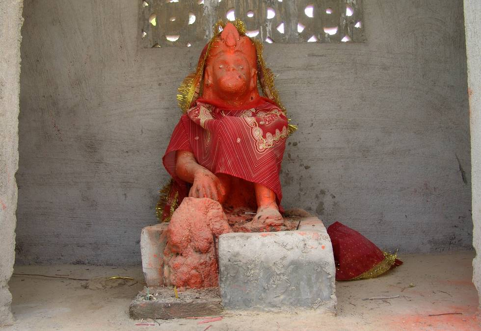

A idol at Mata Hinglaj. This is a new addition.

## Comments (4)

**Ashwini Ratnoo** - August 16, 2005  1:03 AM

The idol is of Lord Hanuman

---

**Arun Naik** - November 13, 2005 10:56 PM

Would the person who posted this image kindly clarify where and when was this picture shot? Ashwani may be correct in saying that it is the image of Lord Hanuman because of the facial expressions of the deity, , but I have never come across an image of Hanuman with his hand on the head of the others, as if offering protection.

On second thoughts, I wonder if there might have been a streak thought in Hindu mythology that to assure Sri Ramavatar, Hanuman would have agreed to show his dedication and love towards Ram, Lakshman, and Sugriv, and this might have been porrtrayed in this image.

If so, then it is bound to be a very very old image.

---

**Sarvesh** - August 30, 2006  1:59 AM

I think it is the image of Bhairav Nath, not Hanuman. Images of Bhairav nath are commonly found accompanying Devi temples. For some reason the image has been coloured red giving the impression of Hanuman. Usual colour of Bhairavnath is black.

---

**Priyank** - October 22, 2007  6:57 PM

A zillion thanks to you to put all images of Hinglaj on your site. It is the most important Shakti Peeth of Hindus. I don't have words to explain how excited i'm feeling now. I want to visit the temple in my lifetime.
Hats off to you once again.

Thanks

---

