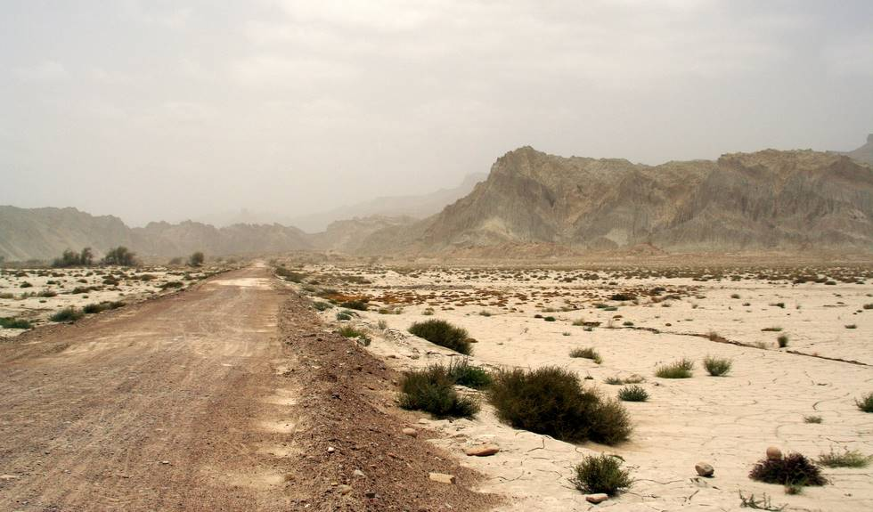

en route...

## Comments (4)

**Ayan Mondal** - December 14, 2005 10:47 AM

breathtaking......... i am an indian originally from calcutta. wish one day visa restrictions will be removed and indians & pakistanis will be allowed to cross border easily.....

i have seen all the 62 pics.... i was feeling as if i am in the desert of hinlaj........too good......thanks for posting nice pictures.

regards,
Ayan.

---

**Nasir Manzoor** - August 27, 2006 12:49 AM

Restrictions? r u sure Ayan cause I know some friends from India who went to school with me in US just came to visit me in Karachi and they did not mention any difficutly.

---

**Ishan Kundu** - October  6, 2006  6:50 PM

This is a splendid collection of photos by OCK. Couldn't imagine that Baluch people are so good to have protected this hindu shrine till today. Wish to visit once. If I get any help from your side (OCK), ready to go at once with a week's pilgrimage visa. Hope to get reply.

---

**Yogesh Rao** - April  5, 2008  1:31 AM

I am a Hindu from India. These pictures show me that that Hindus and Muslims on both sides of the border can co-exist in peace and harmony. I dream of a day when we can live as brothers and sisters in peace without borders. Our destinies are inter-twined. ~~ Yogesh.

---

