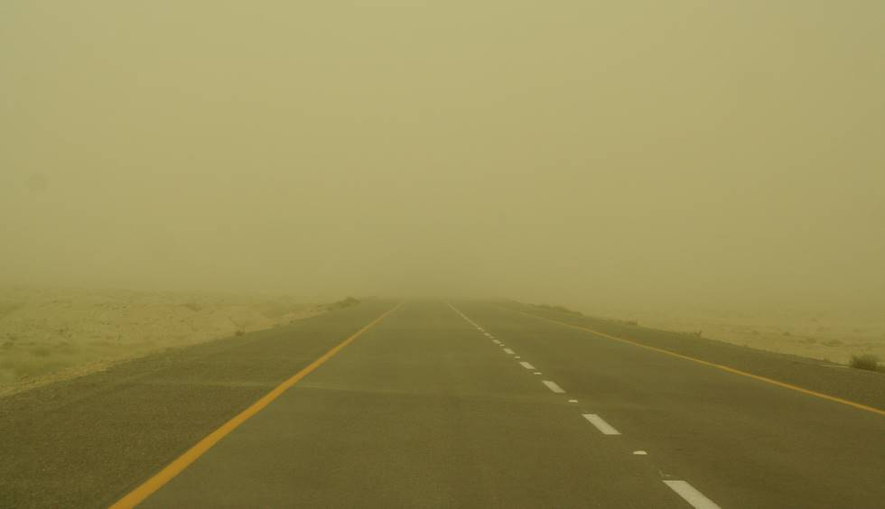

Sand storms are a frequent occurence on the Makran Coastal Highway. This one severly limited visibilty - every now and then a gust would sweep along even more sand bringing visibility to zero for a few seconds as it swept across the road. The wind was fast enough to carry along small pebbles.