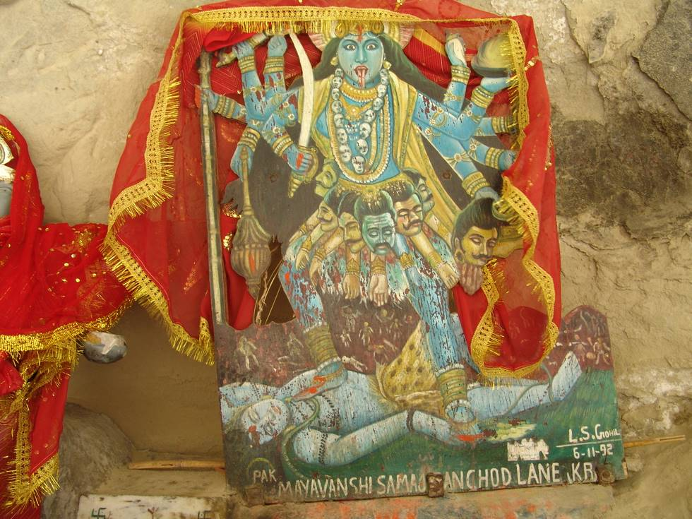

A closeup. Next to the picture is the idol.

## Comments (3)

**sandeep** - November  1, 2007 10:39 PM

this is not the pic of God Shiva...it is a pic of Mata Kali...

Jai ma Kali..

**DR.SHRIKANT** - July  3, 2008  5:54 PM

Being in the other country, visa & other formalities must be mandatory to visit Hinglaj mata mandir? Are their commercial or Govt organisers of the pilgrimage? Whats the duration of the pilgrimage and suggested favourable season to undertake the Hinglaj mata pilgrimage?

**Engr. PRINCE RAJPAL** - August 13, 2008  1:17 PM

Mata Hinlaj Mandir is situated at Balouchistan Province of Pakistan @ Karachi-Gwadar Highway at Aghor Point. Nearby 250 Km from Karachi and 30 Km from Aghore Point into the mountains. Hinglaj Shewa Associations in different cities of Pakistan are working to promote this holy place for foreign pilgrams also. This place darshan take a more value than Haridwaar in Hinduism Believers. Best months of visit are December to April. If anyone wants to visit this Holy Place, Then come to Karachi at Swami Narayan Temple, Karachi. 24 Hour service available to go to Hinglaj in Private or Rental Vehicle. You can e-mail me to guide u more or can ask any quetion relating to Hinglaj Yatra.

