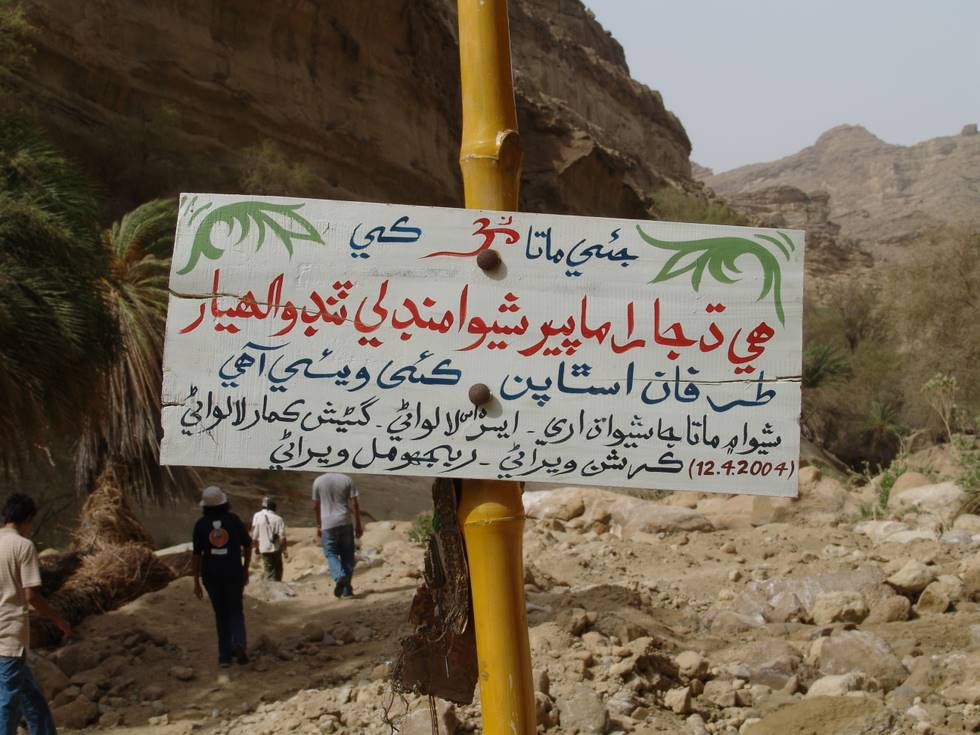

Translation?

## Comments (2)

**Udayan** - February 22, 2006 10:58 AM

I dunno what it means... seems to be in Sindhi...
I can see the "Om" sign though.

**KARAM TALPUR** - December 29, 2008  2:04 PM

THIS IS IN SINDHI IT MEANS THAT THIS SIGNBOARD HAS BEEN FIXED BY A CERTAIN HIDNU CLUB OF TANDO ALLAHYAR IN SINDH. AM I RIGHT. I SHOULD BE CORRECTED IF OTHERWISE.

