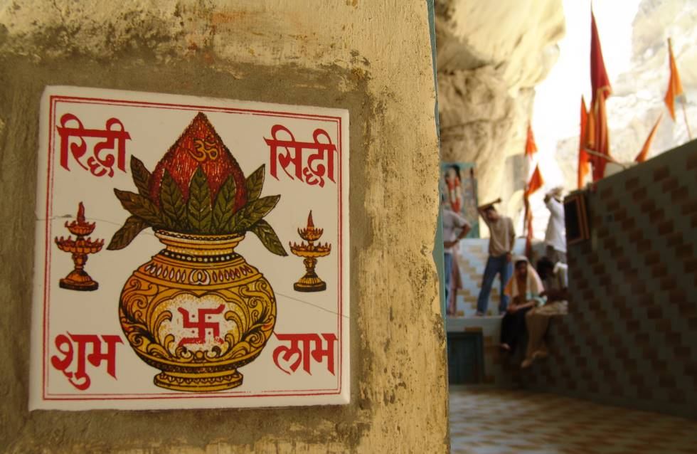

From Top Left: "Riddhi" " Siddhi"
From Bottom Left: "Shubh" " Laabh"
Sign of "Om" Omkaar on Coconut
Sign of "Swastik" means Pious and prosperity.

## Comments (6)

**manish sharma** - August  8, 2005  7:40 AM

From Top Left " Riddhi" " Siddhi"

From Bottom Left "Shubh" " Laabh"

Sign of "Om" Omkaar on Coconut

Sign of " Swastik " means Pious and prosperity

---

**Victor** - August 15, 2007  3:10 PM

Hi! very nice!

---

**Domitilla** - August 16, 2007 10:42 AM

Cool website! ;) Best regards and nice day!

---

**Petronela** - August 17, 2007  3:26 AM

Hi, Good work... Thanks

---

**Walter** - August 18, 2007  1:14 PM

Excellent site, added to favorites!!

---

**Engr. Prince Rajpal** - August 13, 2008  1:27 PM

Mata Hinlaj Mandir is situated at Balouchistan Province of Pakistan @ Karachi-Gwadar Highway at Aghor Point. Nearby 250 Km from Karachi and 30 Km from Aghore Point into the mountains. Hinglaj Shewa Associations in different cities of Pakistan are working to promote this holy place for foreign pilgrams also. This place darshan take a more value than Haridwaar in Hinduism Believers. Best months of visit are December to April. If anyone wants to visit this Holy Place, Then come to Karachi at Swami Narayan Temple, Karachi. 24 Hour service available to go to Hinglaj in Private or Rental Vehicle. You can e-mail me to guide u more or can ask any quetion relating to Hinglaj Yatra. *pmrajpal@yahoo.com

---

