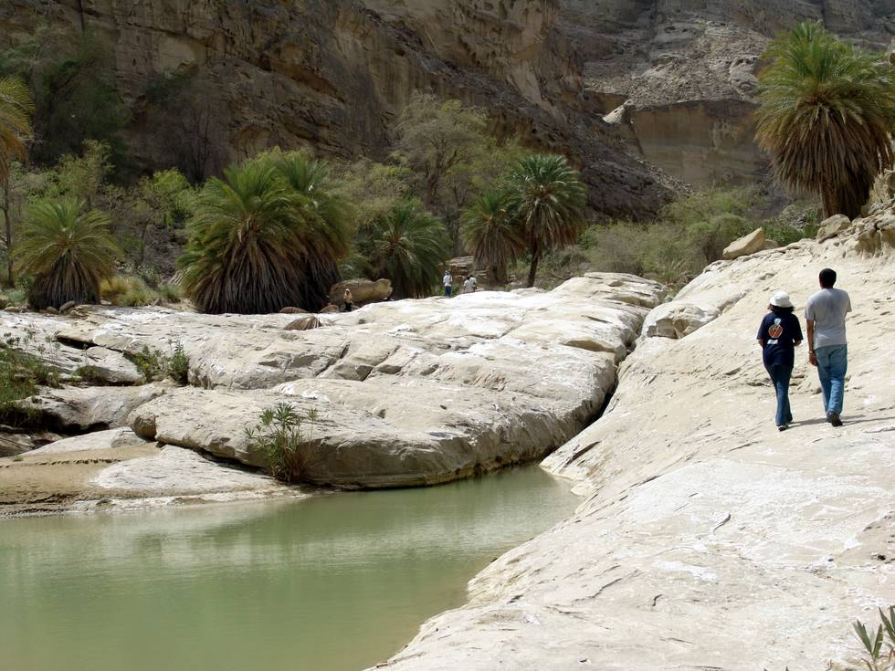

Walking to the temples in Nani Mander. An idyllic walk along the stream.

## Comments (4)

**Masd** - August 13, 2005  2:56 PM

This is the COOOOOOOOOOOLEST picture of whole of Hingol Trip!!!
The date palm trees; the green water and the couple.........wow
Hinglaj is mysterious!!

**Nasir Manzoor** - August 27, 2006 12:40 AM

This is a beautifull pic.....I just wish Pakistan can attract more tourists from all over the world and show Pakistan a peacfull country which will benifit greately the people of land.

**DEEPAK TANEJA** - June  6, 2008  3:08 PM

We Hindus are ready to come as tourists/ pilgrims to visit Katasraj/ Hinglaj Mata and other shrines. Pak tourism shall flourish like anything.

**Shahzeb** - July 22, 2009  1:12 PM

It's good to see people like you deepak :) thanks and yes nasir, i hope all gets better too, Insha-Allah, time will come :)

