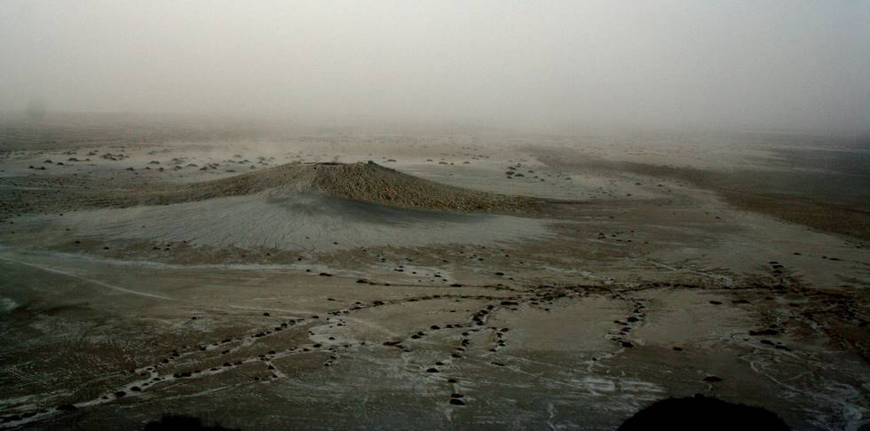

Picture from the top of the largest mud volcano in the world.

## Comments (10)

**VIVEK SEN** - January 20, 2006  8:54 AM

Great site, excellent pictires. I was almost there. Did you take any pictures of the bubling mud at Chandra Gup and Nani Bibi (Hinglaj Mata) ?

**ajai** - March 18, 2006 10:11 PM

excellent pictures. thanks for making us have a view of our ancient treasures. keep it up.

regards

**jamil** - July  4, 2006 12:20 PM

Very good site. I live in Australia and am starving for images of Pakistan like these. Great job! Well done!!

**Nasir Manzoor** - August 27, 2006 12:58 AM

Excellent work guys, please keep it up and please feed your websites links to all major search engines like google and yahoo so Pakistan can get a well deserving presence in world as a country where you can affordably go and enjoy. People here in US don't even know we have so much to offer all they think is Pakistan is a war zone.

**Ramachandran** - September 15, 2006 11:29 AM

Very nice pictures Indeed. I have never been to pakistan and I hope may be a decade from now both our countries will be come friendly enough so that I can go offroading in pakistan

Ram

**Deepal** - November 29, 2006  3:03 PM

Excellent Pictures.... I had just heard of the place . . . Saw it here for the first time . . . Wish to visit the place soon.

Many Thanx. . . .

**Rahul Gupta** - October 31, 2007  8:26 PM

Thanks a lot for the pics... Appreiciate this

**Saswat Bhattacharya** - November 21, 2007  4:55 AM

Great photographs. Seems like an exotic trip through a rugged terrain. Reminded me at times of Utah country side. Hope I will be brave enough to visit Pakistan some day soon :) Though in the current political state even my Pakistani friends are not encouraging me much...Very curious about the livelihood of people residing in those 3 huts.

**Jim Mallinson** - December 19, 2008  2:38 AM

Fantastic pictures, thank you. They have rekindled my desire to visit Hing Laj. Perhaps I'll take my paraglider and ride some volcanic thermals...

**dr kheemchand** - January 22, 2009  2:45 AM

thanks sir, a great wonderfull work u have done, to show the Hinglaj teerath to those who had keen to go there, i dont'k know who r u n where i can find u, but when ever i will meet , i will again perform thanks to u. JAI MATA DEE

