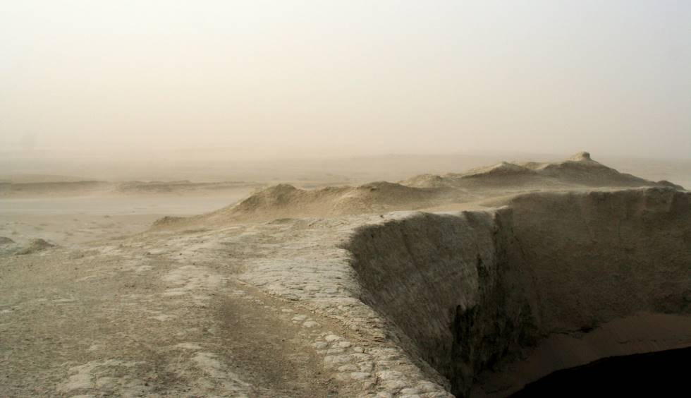

A picture of the smaller mud volcanoe. There is a large lake inside, with a gas bubbling up.

## Comments (1)

**shameem Ghori** - May  8, 2009  2:02 PM

chandur gupt. astonished To see the photoes of mud valcano. I visitied up to kund maleer and thought this valcanoe only a heap of mud or sand and left it .now Iwant to see it.these are very beautiful photoes.Dr.Shameem ghori,Karachi

---

