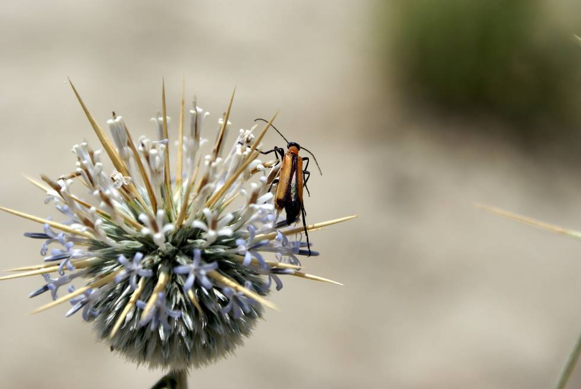

## Comments (4)

**Obaid** - October 18, 2007 10:28 AM

That is a great shot!
mind if i ask which camera/lens you are using? Really enjoyed all the pics. Thank u so much for sharing your adventures and taking the time to take such splendid pics.

Regards,
Obaid
Lahore.

---

**KO** - October 26, 2007  5:54 PM

All these pictures are from different cameras - so I'm not sure which once this is from. Have to add EXIF info to the pictures.

p.s thanks for the good words!

---

**Mahera Omar** - October 26, 2007  6:05 PM

Thanks. Glad you like the photographs, which were taken by a number of people who went on the trip. This one is from a Sony DSLR A100.

Focal length: 70mm
Exposure time: 0.001s
Aperture: f/6.3
ISO: 100

---

**Mir Zafar** - February 17, 2010  3:03 AM

Man, you guys are equally good with cameras. I'd love to meet you ALL someday.

---

