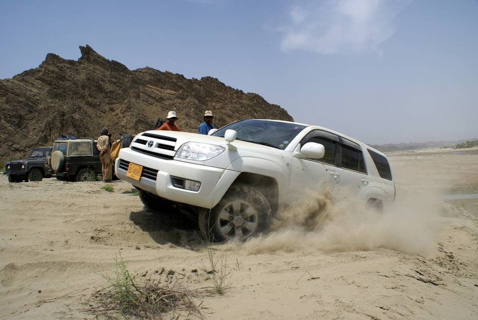

Toyota Surf, recently acquired, on it's first offroad trip. It's now being upgraded with ARB Old man emu suspension (to raise it a couple of inches) and metal front and rear bumpers - to make it more fit offroad.

## Comments (1)

**Hamid Omar** - October  7, 2007  3:45 AM

I drove the Toyota Hilux Surf on this Hingol off-road trip and it performed really well. It has a 3.4 liter V6 petrol engine and automatic transmission. On its next trip its suspension would have been upgraded to raise its ground clearance - a must for going through river crossings and rocky areas.

---

