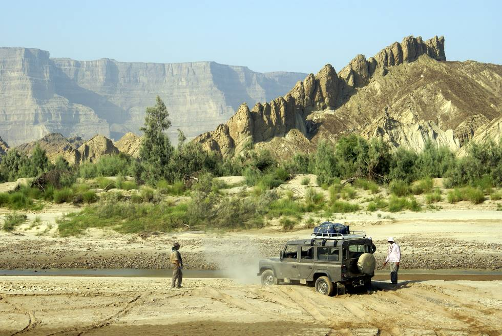

It doesn't look stuck, but the sand was very slippery, and the car bogged down here and couldn't get moving easily.

## Comments (1)

**M. IQBAL** - November  9, 2007  4:13 PM

Isn't landrover a suitable vehicle for offroad journey? We have seen this is frequentley used in national geographic's adventures but in Hangole it coundn't performe well, i am confused.

---

