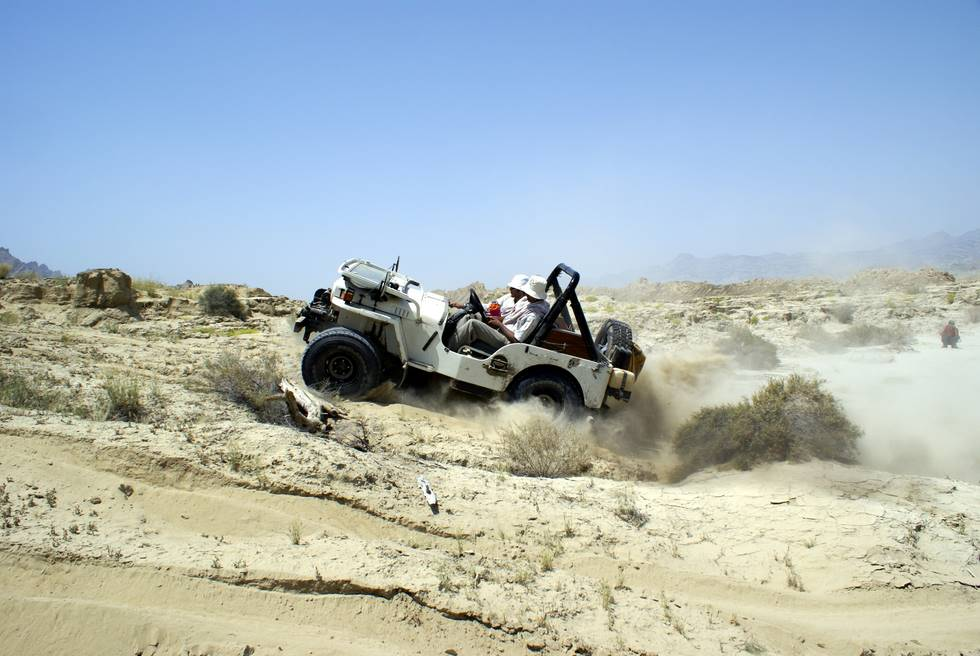

It took a few attempts as there just wasn't any traction.

## Comments (2)

**Adeel** - November 27, 2008 12:07 PM

If this is sand then the key is to reduce pressure to 15psi on normal tires. On bigger ones even reduce it to 8-10 to get better results.

**Hamid Omar** - November 27, 2008  7:41 PM

In many of places we go - the prob is that there are only a small patch/area of soft mud or sometimes sand - then there are dry streams with lot of boulders/stones - reduced air pressure in boulders means tyre would come off the rim. Our group is usually 6 to 10 or more vehicles so if somebody does get stuck, others are there to help out. Reducing tyre pressure of so many vehicles and then refilling again many times a day too big a hassle & time consuming!

