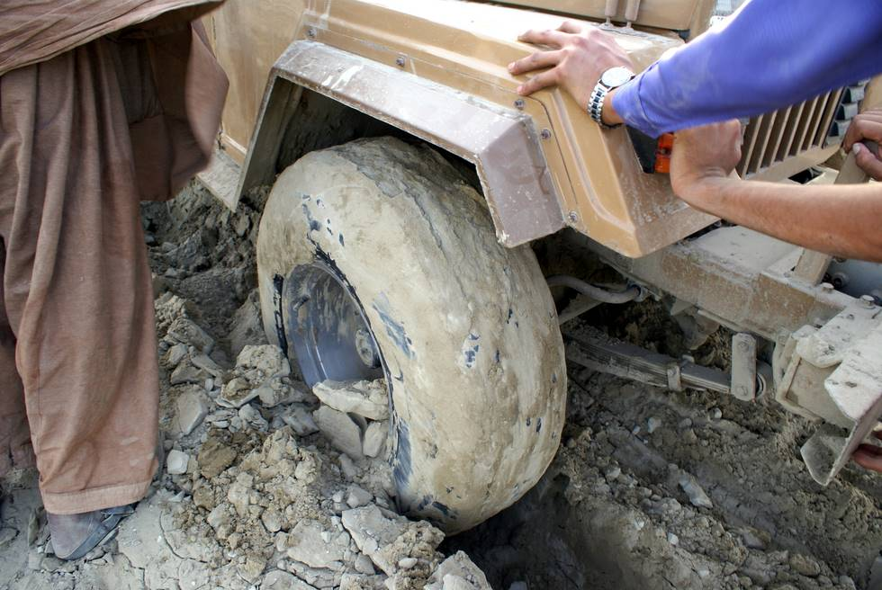

Trying to push it out while winching. These are Dunlop all-terrain tyres - tyres which don't have wide groves loose their grip completely in muddy terrain. For muddy areas you need true mud tyres with wide grooves, all-terrain tyres don't cut it.