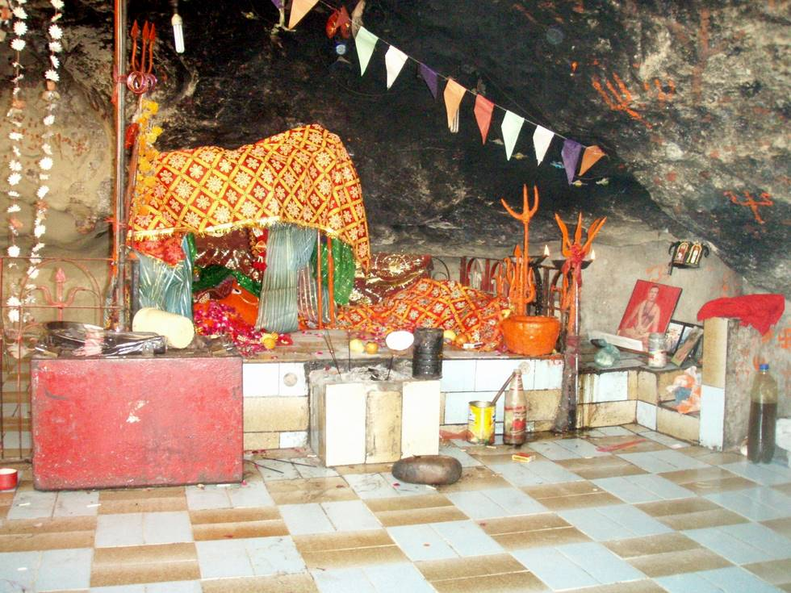

## Comments (2)

**Vinay Khatri** - November  6, 2007 12:44 PM

This is Hinglaj Mata Temple in Baluchistan. In Hindi: हिंगलाज or हिंगळाज, in Gujarati: હિંગલાજ or હિંગળાજ

---

**Vinay Khatri** - December 29, 2008  7:25 PM

Do you have GPS coordinates? please share.

---

