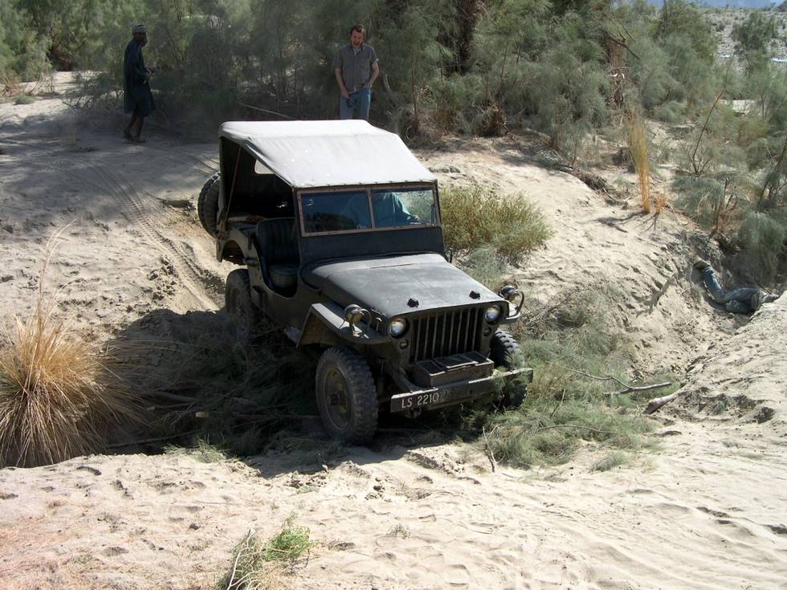

This Jeep can go places where newer models can't even dream off.

## Comments (3)

**Seyit** - April  6, 2006  2:12 AM

Your MB looks rather plain,except for the second BO light on the right front fender.I hope things are well under the hood and along the driwetrain.

**jagraj singh sahney** - May 21, 2007 11:49 AM

excellent piece, I really admire the way it has been restored. I have just bought the same model and do wish to restore it tastefully. Shall be very thankful if you can guide me.

**Mustufa** - August 15, 2007 12:35 PM

excellent piece, i also have this original ford jeep model1942, i need ur help there r some accesories which i dont have so i'ill be very greatful if u can provide me or can tell from where i can get,

