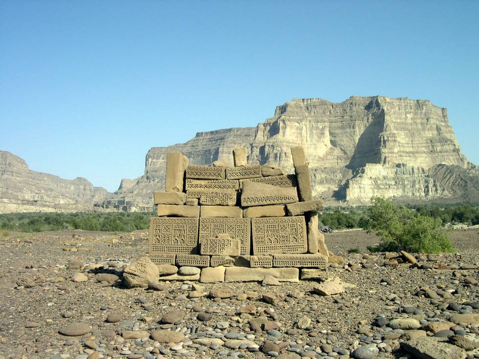

A solitary runic tomb literally in the middle of the Hingol valley.

## Comments (1)

**Dr. J** - October 19, 2008  2:09 AM

Can anyone tell me more about it and what is the language/script on the tomb?

