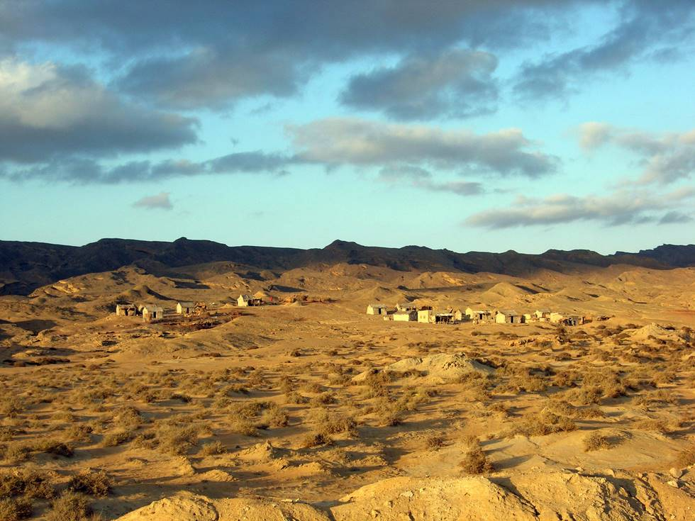

This village was just off the new coastal highway.

## Comments (3)

**Abdul Rauf khan** - March 20, 2006 10:20 PM

What a beautiful thinking of the photographer.i really do appreciate and pay selute to photographer...
Best Wishes for Photographer By Abdul Rauf Khan

---

**Shahid Iqbal Muhammad** - March 28, 2006  5:30 PM

Really,,,,
First of all, the credit goes to photographer,
then this Hingole National Park,
I did'nt hear nor saw in my life,,,
I was just surfing the on the net and incidently I got this site,
so,
I was too much excited,
Really, I am going to plan now to go to Hingole...

Excellent photographs....

Best wishes to you ppl...

---

**Ibad ul Haque Khan** - July 29, 2008 10:42 PM

You people make me say something......

Nicely taken photographs, no doubt about this, all credit goes to photographer but it seems that the scenic beauty of the Hongole also speaks by itself and the different land scape from rest of the Pakistan also has an impact.

One should proud of being citizen of such country....

I also owns a 4x4 but lives other part of the country (Islamabad) where mountains challenge you. I have solo trips to Deosai plan (Northern areas), Gitti das (babusar pass, top of Kaghan velly- making road to chillas)... Siri paia (Shogran). I have snaps to share if anyone have interested.

I will love to join group who are interested taking chalenges in this part of country..

With best regards

Ibad ul Haque

---

