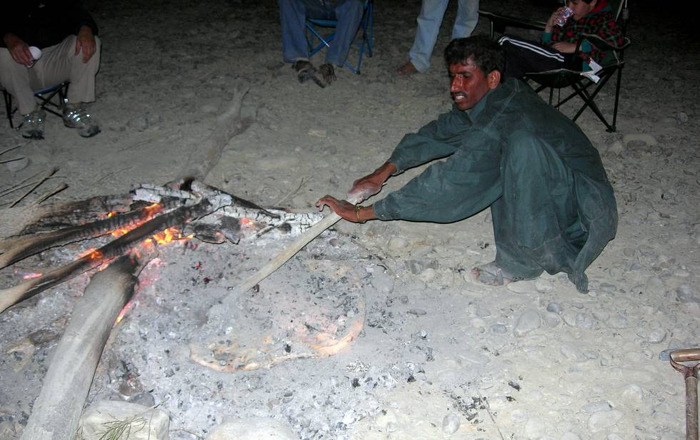

Baking bread, Hingol-style: French croissants were never like this. You make the dough on the stones, then roll it out, slap it into the fire, wait 20 minutes and the bread is ready. It makes delicious eating.