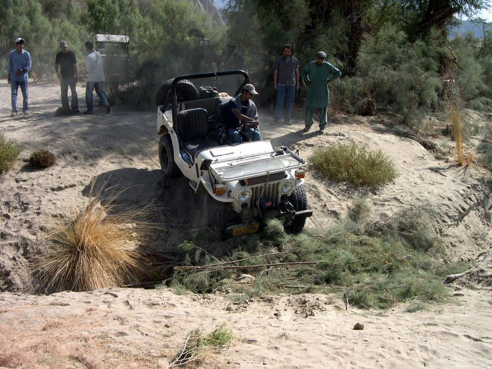

Vintage 1951, this jeep can still put its younger successors to shame. The most powerful jeep crossed it with absolutely no trouble!

## Comments (2)

**Khayyam Ally** - March 26, 2006  1:40 PM

Excellent photos I must say. Also, the concept of travelling through Pakistan by road is fascinating. I also love to travel and have gone twice to Murree and back in my Suzuki Mehran!!!! Well, I travelled with my son and wife and it was fun. We started from Karachi making stop-overs at Hyderabad, Sukkur, daharki, Sadiqabad, Multan, Lahore, Islamabad and finally at Murree.

---

**asif ayub** - July 10, 2006  9:00 PM

great site, i had been offroading from quite along time with a group of friends, but i never knew that there is an off roading club in karachi, i have a 1995 surf please inform how can i join the club..

regards,
asif

---

