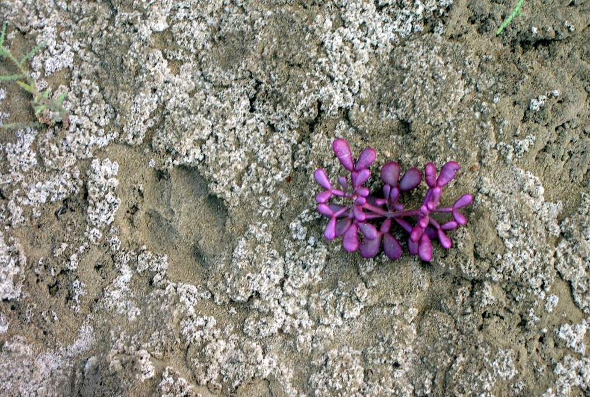

Guess the animal which has left it's prints right next to the flower.

## Comments (1)

**Addy** - September 11, 2011  6:47 PM

Its must be A sind leopard. i have seen this animal in Hingol national park.more than 20 KM away from Nani mandir. in 2010.

---

