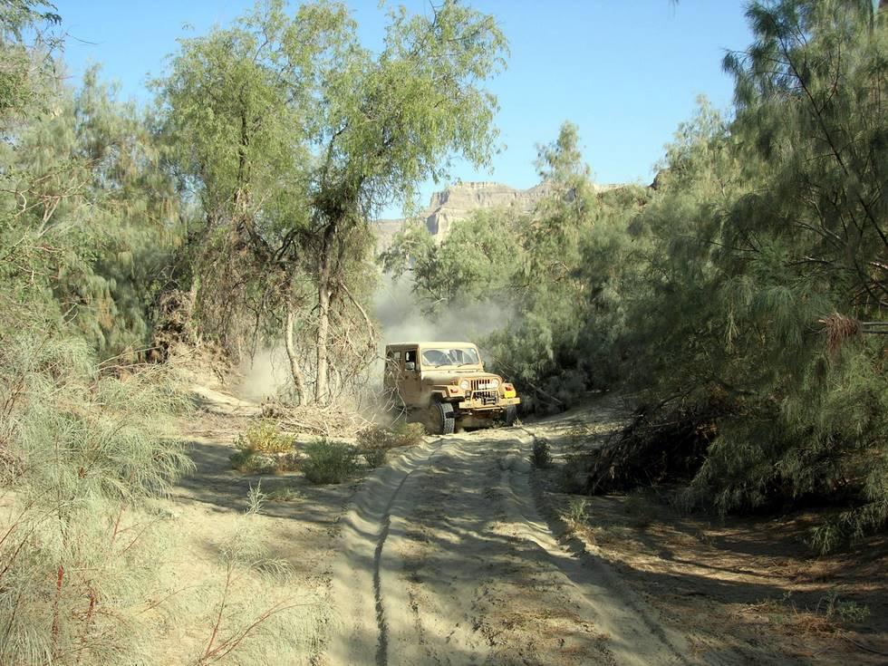

Shikar country minus the shikar (because of unprecendented floods in the Hingol the year before). The tracks the CJ-7 is following are those of Jeeps that have just gone before.

## Comments (1)

**Tom** - April 28, 2012  1:57 PM

HAHAHAHAHAHHAHAHA WOW Reallyyyyyy mature. As**** ******** I asmuse? Or someone just like her (which may even be worse than actually being her ) I'm glad you find so much humor in making fun of other people. Whatever makes you feel better, honey.

---

