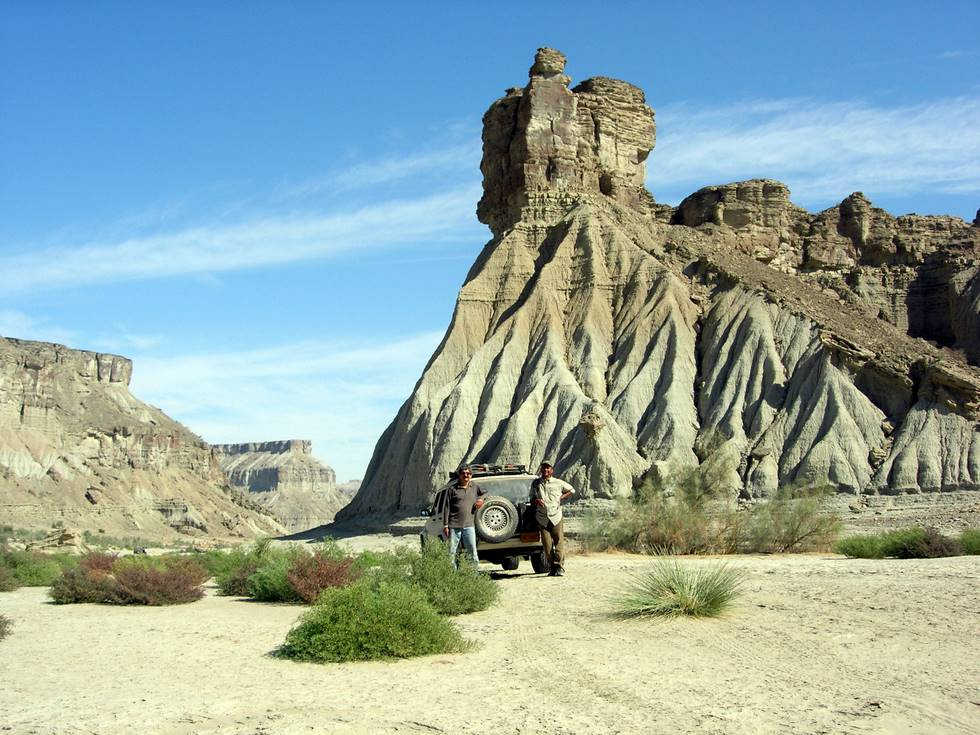

Hamid Omar on the left and Azhar Khan on the right. Azhar has been exploring the Hingol Valley for the last 5 years - in search of an elusive breed of wild pigeon.

## Comments (2)

**Mazhar I. Mahmood** - July  5, 2006 12:31 PM

Its Nice Pic. but no mention about the Fortress, its history or anything, what kind of reserach Mr. Azhar Khan was doing?

**Danish** - December 20, 2006 12:08 PM

Can you plz guide me about the exact location of this place in Hingol area

