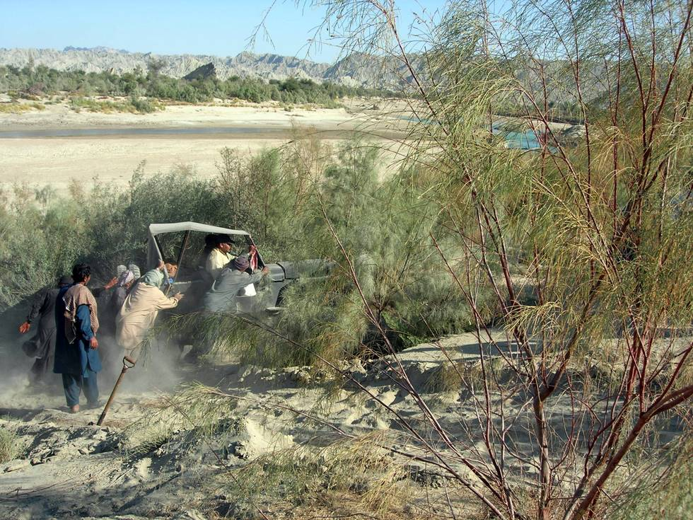

Even Wazir Ahmed's 1942 model Ford GPW needs a little help from friends sometimes, though he would dispute this. The Jeep Cherokee and Cj7 made it up without any help - possibly due to the wider tires.

## Comments (2)

**Fahad Ali** - August 25, 2006 10:09 PM

Its shocking for me that Ford-1942 needs help to climb up hill in sand.Actually its not the Jeep its the Man behind the wheel.If I may given a chance on My-Willys M-38 (1942) I am sure I can perform much better than Papu Mian,I am planing to visit Hingol in this year & lets see who got the passion.Nothing is impossible in my Books as I can Prove that "Willys Makes Its Own Way"........................................................... :)

---

**Maksim** - April 28, 2012  5:08 PM

You can get a lot of car for 10K. Go for a 4 door car that is cool to save on insurance. The VW Jetta or a used BMW 3 sriees (4 door) would be a great. car. A Honda, Nissan or Toyota (used) will not cost you too much in maintenance. I have a Nissan Pathfinder with over 100k miles and I think it has a cool factor. A jeep will alway be a cool ride, but I think insurance is expensive. Don't forget to get quotes on car insurance and miles per gallon to figure out your total monthly cost. We just started site to help people save for a car and dealerships match a % of your savings. Check it out and your feedback would be greatly appreciated since we plan on launching soon.

---

