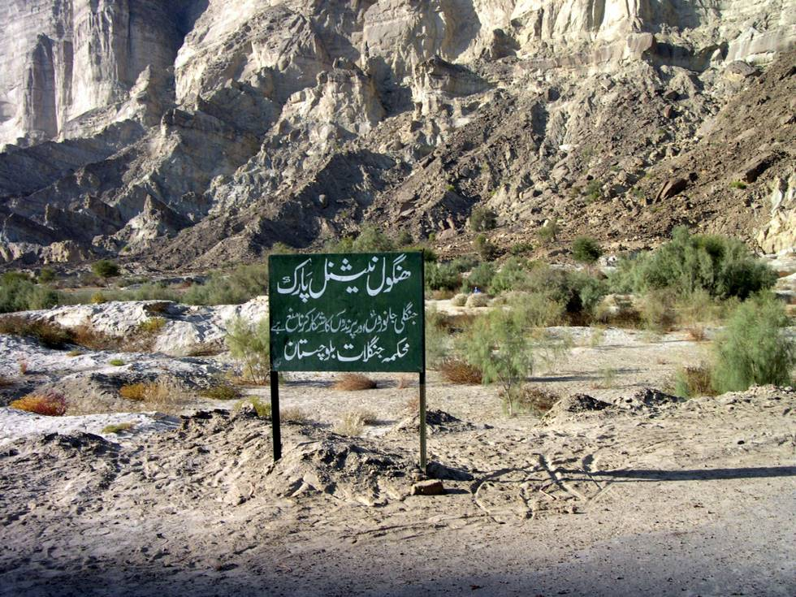

For those who don't know Urdu, this sign says Hingol National Park (Hunting Prohibited).

## Comments (4)

**Waqar Ahmed Khan** - February 13, 2006  5:17 AM

Man great pics can't get better then them. Pakistan is great country in the world ..... if you guy's go again I would love to go with you guy's I'm from UK Manchester .... please e-mail me thank you ..

---

**hydrocodone abuse** - March  4, 2007  2:36 PM

Cool site. Thank you!!!
<http://s-url.net/02yj/> hydrocodone online

---

**Adeel Bashir** - September 11, 2011  6:52 PM

We have done hunting in 2010 in october. and Its true , there is hunting prohibited.but i had kinda source for hunting. well i am a fan offroaders. you guyz rockx

---

**eddie** - April 29, 2012  1:23 AM

Good, sincere Jaja your coamnetmry. I would only add that if it were your first approach to the warehouse, you do not stop proving the Black Eyes syrah, Black Eyes great reserve and the Passion! not that he happened to them to the Hussong with euphoria. (I cheap generic hydrocodone that he gained euphoria to them) so that the three wines that I mention to you, are really cheap generic hydrocodone , pls prue9balos and platicamos.

---

