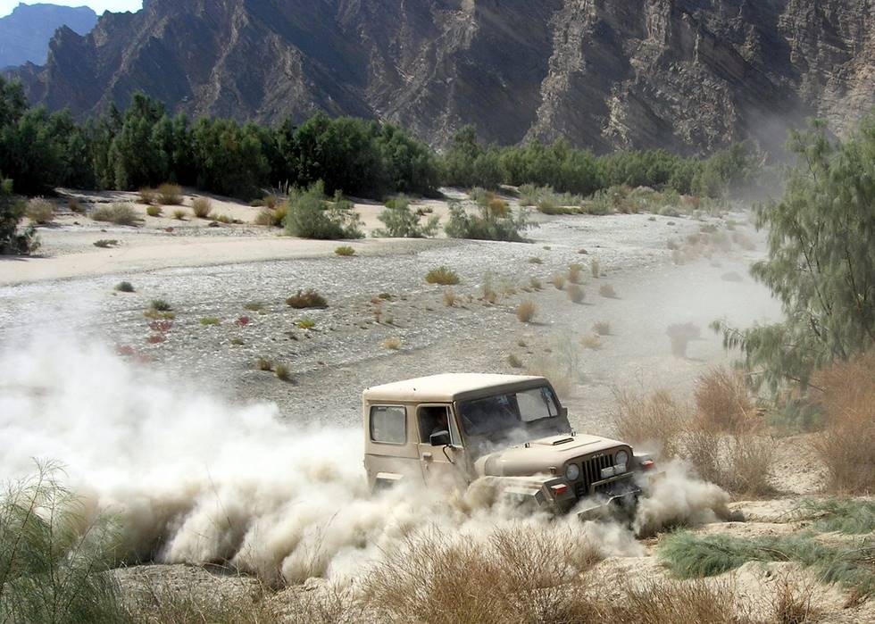

Even though Taimur Mirza's CJ-7 doesn't look stuck, it is, in fact, well and truely stuck.

## Comments (3)

**imad** - February  2, 2006 12:52 AM

Well, it wasn't exactly stuck; just unable to proceed any further up the embankment. It went back down and came back up around the left of the track without any problem. The winch cable came out later when there were no cameras around to catch TM in the act.

---

**Tanya** - May 26, 2006 12:12 AM

Timmy's CJ never get stuck, its a REAL jeep thing I dont think you would understand.

---

**Myastaycumindown** - April 28, 2012  6:50 PM

Wonderful - CONGRATULATIONS to you and J! I knew it was going to be a girl. I had a feeling. I had hoped it would be for you so we can camopre stories and talk girly stuff. You'll love having a daughter! It's such a fun experience. I can't wait to see how you dress the little fashionista and hear about the diva drama too! Just think - chick movies, shopping trips, reenacting old movie scenes together! It's going to be great! Trust me. I love my four year old girl Vivian and can't wait to have this other one too (Lana Jane). Girls have more fun! ;-) Enjoy this special time. Can't wait to hear your name pick! Best wishes,Mandy www.mandylifeafter30.com

---

