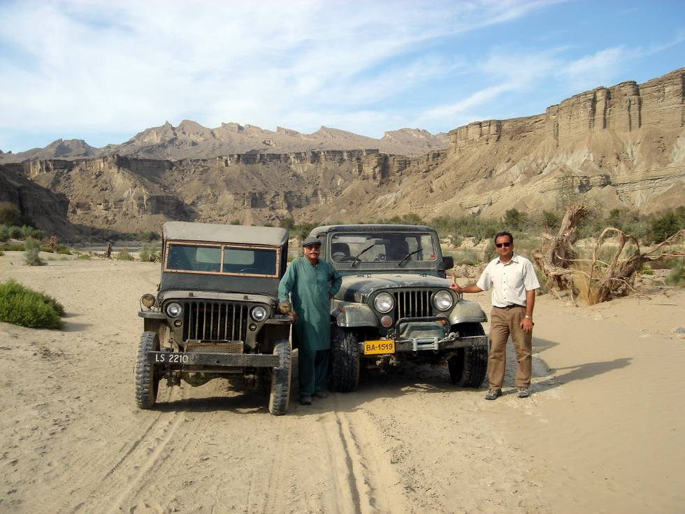

On the left, Wazir Ahmed (aka "Pappu Mian") with his 1942 vintage Ford GPW, and on the right, Ahmad Omar with his circa 1970's Jeep CJ-7.

## Comments (2)

**Saad** - January 24, 2006 12:16 PM

What are the specs of Pappu Mian's 42 GPW? It seems quite capable of doing such trails along side the modern Jeeps.

---

**Imad** - February  2, 2006 12:46 AM

Bone stock except for Toyota 1C diesel engine. It doesn't do trails alongside modern jeeps; it stays far ahead of them:) BTW, the modern jeep in the pic above is a 1979 CJ7.

---

