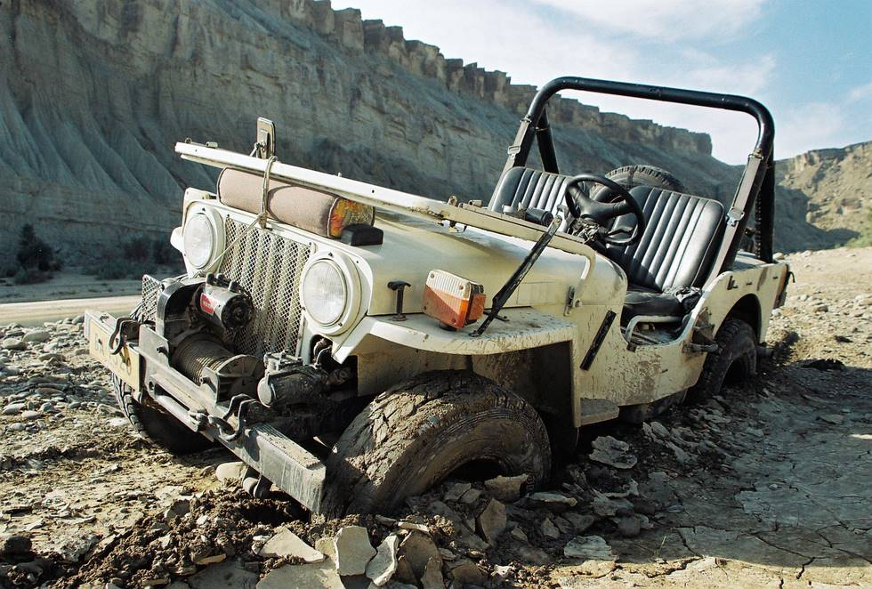

One of the advantages of getting stuck is that you get a lot of pictures taken.

## Comments (1)

**Hamid Omar** - August 11, 2007  5:44 AM

Hingol Valley of Baluchistan is an off-roaders paradise! Its the most fun place for 4x4 driving experince! (But remember - its a no go place in the rainy season).

