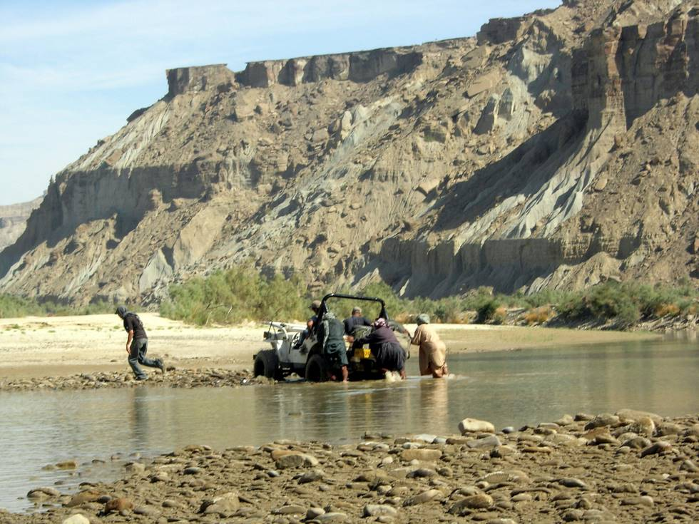

It helps to have a lot of muscle power available (even for the Most Powerful Jeep).

## Comments (1)

**Katharina** - April 28, 2012  7:09 PM

I love the WDZ! I have a confession .I am now a Saints fan! Being born in Dallas and raesid in Fort Worth, I do love my Cowboys and always will. However, I am tired of seeing my QB loafing around with the Blonde and trying to qualify for the U.S. Open. My owner is a whole nutha story! I had the opportunity to attend the first Monday Night game last year when the Viks were in town, and even though the outcome wasn't what we wanted, the SPIRIT of the WhoDat Nation left a deep impression on my Cowboy heart. I love New Orleans and I will be wearing the Black & Gold this season. Good luck and see you soon! ..if my Cowboys pull it out some day and act like champions again, I will have to split the jersey and do B&G on the front side and B&S on the back. It is what it is! Thanks!

