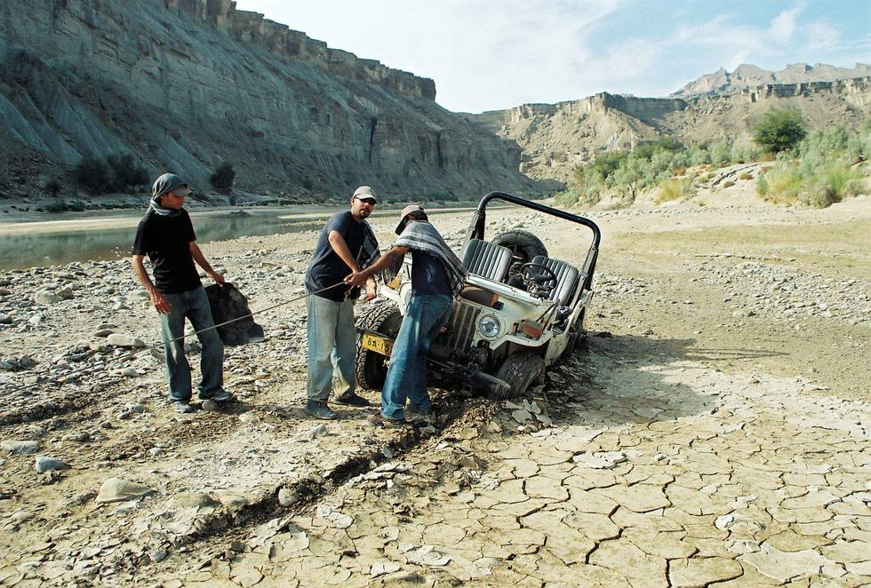

Winching was the least muddy option here.

## Comments (1)

**Geetika** - April 29, 2012 12:22 AM

There is an opt out proceeding in preocss at the California Public Utilities Commission. I believe it will be completed within a few months to a year. Restoring the analog meters is one possible choice, but the Commission has not ruled on it. People have been restoring their own analog meters, with an electrician's help. To stay informed of this issue read the recent posts on the home page and sign up for our email list:

