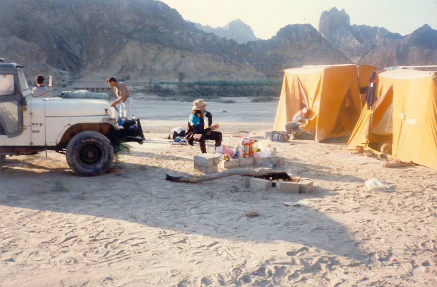

Waiting for a brave man to cook breakfast.

## Comments (2)

**Jim Nibblett** - August  7, 2003  2:37 AM

More Pictures! Especially where one might build a dam out of sand bags. Writing directly to me would be best. Thanks,
Jim

---

**Jef Simpson** - September 20, 2004 11:49 PM

Hello I am an avid offroader here in the U.S. I always enjoy seeing pictures of your offroading adventures. Can you email me some more? Do you use Jeep parts in the Jeep pictured above
or have you adapted toyota parts to it? I have 3 JeepS of my own and offroad them as often as I can.
We do alot of mud and rocks here. What kind of terain do you 4 wheel in?
Jef Simpson

---

