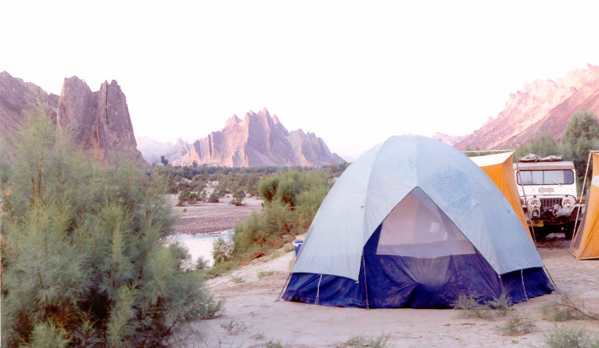

Another view of the Campsite alongside the Hingol river. This particular spot was a great campsite, with every necessity readily available.

## Comments (3)

**Shahid Virk** - July 18, 2004 10:34 PM

informative site,,,stunning pictures...enjoyed visiting the site...keep it up

---

**Azhar Khan** - December 24, 2004  5:23 PM

Hi ,

Great pictures of the Hingol area. I have been exploring this area my self for past few years and have gone past Hariyan. I was trying to reach Gohran Ghatty but failed as I was alone and my tyre took a peice of sharp wood frm the side.
The Chander gupt and the place that yu have camped are really great. This place where yu have camped had two large Crocodiles before the high waters of year before last.
I take Camel trails also beyond Nani. I am now trying to go up Basool rive close to Ormara.
I will send you guys a picture where an Ibex is standing not very far from your camp, right across the river. I will have to find that picture, I will send it in a couple of days.
Pls check your "Contact" Page it seems hacked.
This is a great website, I think you guys are doing a great job. Let me know if can be off any help.
Azhar
Azhar

---

**tezza`** - May 18, 2005  5:25 AM

good pictures but might need sum of mud volcanoes erupting...now that would be kewl

---

