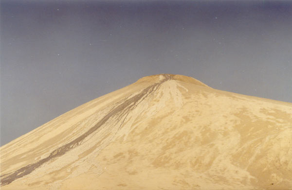

A picture of the top of the mud volcano. You can see the mud flowing down in slow motion along the left side. This mud is supposed to have great healing powers, and people come here to bathe in it.

## Comments (35)

**Taimur Mirza** - August 18, 2003  2:46 PM

There are two large active mud volcanoes on the coast of Balochistan. The higher one being 450 feet and the other about 250 with a large crater housing a small pond of bubbling water. These volcanoes have a special position in the Hindu religion and are called "Chandra Gups". Devotees travelling to the temple of Hinglaj stop here and make offerings of coconuts and other rituals. The temple of Hinglaj is further along the coast about 100 kilometers. Amongst numerous these two are the largest and highest mud volcanoes in the region.

---

**Arun Naik** - January 11, 2005  5:34 PM

I live in New Delhi and wish top make a pilgrimage to Hinglaj via Chandrakoop. I do not knbow how to visit these places. I shall be highly obliged if someone can guide me. I am also looking for fellow pilgrims who would like to undertake this journey with me.
Arun Naik, New Delhi

---

**Azhar  Khan** - February  4, 2005  4:18 PM

Mssg for Arun Naik,
Hi My name is Azhar and I am frequent visiter to this area of Hinglaj's mandir. The annaul pilgrimage is some time in March. I will find out for yu the exact date as I will go there next week.
You will have to come to Karachi and then go to Uthal a small town in Baluchistan province which is About three hours drive. This is where the yatra starts. People go by Cars, jeeps, Bikes even on foot.
If yu go by car or jeep it will take yu one and a Half hour to chadarkoop and another one hour to Hinglaj.
I will leave a mssg for yu here about the exact dates. Try searchig Nani mandir and Nani hinglaj as ther are at least two web sites posted about this pilgrimage. They might be able to help yu also about yr arrangements.
Azhar

---

**Susmita** - March 16, 2005  3:28 PM

I am an Indian. I intend to make a pilgrimage tour to mata hinglaj. Is there any tour operator either in Delhi or in Karachi.If anybody knows please help. I know one such operator from Kolkata, but I want to make it with local people.Please help.What will be the cost involved?

---

**muhammad ali** - March 17, 2005 11:41 PM

salam.me mashkel karehne wala hoon.aap logon ke mashkel aane se mutaalliq mallom howa to bhut afsoos howa kiyoonke us waqt me dubai me tha agar next time aap logon ka mashkel ana howa to pease mujhe zaroor bata dejeiga aap logon ki khid mat karke mujhe khoshi hogi.mashkel ke bare me aap logon ko buht malomat fraham karoonga.mera email hai===anjum851@hotmail.com

---

**Salman Ali** - March 19, 2005 12:50 PM

Dear Sushmita,

Thanks for ur interest. I dontv think the trip to Hinglaj will be very expensive, especially not if u go with one of the many groups of local Hindu pilgrims. I have some Hindu friends in Karachi, and if u like I can find out the cost of such a trip for u.

Regards,

Salman Ali

---

**Salman Ali** - March 19, 2005 12:55 PM

Dear Mohamad Ali,

This is so very kind of you, we will definitely inform when we plan our next trip to Mashkhel. It is this kind of hospitality that makes Baluchistan one of our favourite destinations.

Regards,

Salman Ali

---

**Arun Naik** - March 28, 2005  2:23 AM

For Sushmita and Azhar Khan,

Thank you for your responses. PLEASE write to me at akn@vastusindhu.com (www.vastusindhu.com is my personal website about Vastu architecture and I invite you to visit it) so that we may work out a trip to Hinglaj.

I live in Delhi.

Arun Naik

---

**Jai singh ratanoo** - April 12, 2005  7:41 PM

Hi Arun
how are you. My name is jai singh . I am live in delhi and i am intresting to know about hinglaj mata temple in bluchistan. I have been searching about hinglaj mata last five year.
now i search on web then i found about you. so please send me address and other information about hinglaj mata.
my Email - ratanoojai_singh@rediffmail.com, jksingh_jai2000@yahoo.com
my phoneno. 919891238173
91 11 26532460
your
jai singh

---

**sachin** - April 14, 2005  7:30 PM

Hello,
This msg is for all who are seeking information about Hinglaj mata temple. I too was searching this info for my uncle. During my search I found this website www.hinglajmata.com which has has most useful info available. There are some contact details of the people who are actively involved in management activity related to it. Also there's 1 link of Yatra 2000 where Yatra details are given. hope this will be useful for all u people.

---

**Pankaj** - April 21, 2005  4:53 PM

I want to visit Hinglaj temple in Balochistan, can any one guide me how can I reach at there. I am from Surat Gujarat India.
Hinglaj is our goddes, I know that from Karachi we can go at there but how in which state it is ??

Pankaj Gandhi

---

**Amit Makwana** - July  7, 2005  3:21 PM

I want to visit Hinglaj Temple at Blochistan, I want to know history about Hinglaj Mata. Pl. help me.
Hinglaj is our Goddes.

Amit

---

**Dr. Dev** - July 16, 2005  4:07 AM

my ancestors were the original inhabitants of Hinglaj. they left Hinglaj in 680 A.D., when the Arabs conquered Hinglaj. if your family diety/god (kul devata/kula devata) is Hinglaj Mata/Hingulambika, e-mail me at jhingade@gmail.com

---

**Vinod Kumar** - August 25, 2005  1:17 PM

Hinglaj Mata Ki Jai

When will be the next trip i inform on this site... coz this year due to bad weather... yatra was cancelled and next in april or march 2006.

---

**Vinod Kumar** - August 25, 2005  1:38 PM

I m great to know that many people anxiously want to visit Hinglaj Mata Mandir.

That place u forget all only u and Mata u feel so nice there. In my first yatra in 2004 i saw many miracle and my beleive on Mata become so strong.

So if u want to visit, the next yatra will be in the month of march or april 2006.

If u want any information don't hesitate to contact me, i pleased to inform u. I m not a member of Hinglaj Mata Seva Mandal but i m the devotee of Mata and pleased to help other devotee.

Dont forget me in your Pray's.

Vinod Kumar

Jai Hinglaj Mata

---

**Satyasri Ukil** - September 17, 2005  2:36 AM

I am Satyasri Ukil from Delhi.
Wish to visit Hinglaj Shrine.
Count me in if you are making a Yatra.
My e-address is: sukil@chitralekha.org
Thanks.

---

**Arun Naik** - November 12, 2005  9:35 AM

Dear all friends,

Please refer to my first post on Jqnuary 11, 2005 on this column. I am glad that so many of us have shown interest in visiting Hinglaj Temple. I and Taimur have been in touch and he has given valuable information and promises of helping during the yatra. We hava a sizable number of co-yatris and I suggest that let us plan a yatra in February 2006.

My e-mail is akn@vastusindhu.com. Kindly get in touch with me directly so that we may form a discussion group and take it further.

Arun

---

**Pritesh Thakor** - November 12, 2005 11:43 PM

Hi,

Its good to know that there are lot of people looking for information on visiting shree hinglaj mata temple in baluchistan. I am also interested in visiting the same. Detailed information on how to get there would be of gret help to me. I also need details on getting the visa as I am from Mumbai, India. I am searching for all these information since last two years.

My email address is pritesh.thakor@gmail.com

Regards,
Pritesh

Vinod Kumar: Could you please give me your email id...?

---

**Arun Naik** - November 14, 2005  5:05 PM

ANNOUNCING YAHOO GROUP ON HINGLAJMATA

please visit <http://groups.yahoo.com/group/hingalajmata/> and join the group for information and pictures.

ARUN NAIK

---

**Vinod Kumar** - November 14, 2005  9:27 PM

Dear Mr. Arun

I hear that u and Mr. Taimur plaining to visit Hinglaj Mata Mandir in February 2006. I suggest u that please first contact with Hinglaj Mata Mandir Committee members. Because of this year flood destroy some part of Mandir and revocation take place and its soon completed. But i also suggest the yatra start from or after Hanuman Jayanti, so its if u visit in that days.

Vinod Kumar
vinod128@hotmail.com

---

**opmehra** - November 15, 2005  9:54 PM

following contacts may help in organising hingulaj yatra:
Veeramal K.Dewani, Sunderdas K.Dewani
Chief organizer, Office secretary
Shri Hinglaj Sewa Mandir, Shri Hinglaj Sewa Mandir
House No.100 Swami Narain temple estate, A-30 Amir House
M.A Jinnah Road, Civil Lines F.J Road, Opp. PACC Cantt.Station,
Karachi, Pakistan. Karachi, Pakistan
Tel: 262 4485 Tel: 521 8109 , 565 2433
For more details visit www.hinglajmatamandir.com/info.html

---

**Ayan Mondal** - December 13, 2005  3:46 PM

Hi Arun & Taimur,

It's really nice to meet enthusiastic people for visiting Hinglaj temple. I am originally from Calcutta and now-a-days working in Bangalore. I am also very enthusiatic to pay a visit to Hinglaj Temple. However, me and some of my friends are interested to visit Hinglaj in Jan / Feb 2007 (Not now). Hope we will get valuable information from you.

my email id is ayan_mondal@balilife.com (plz mention HINGLAJ as the subject line).

take care,
regards,
Ayan.

---

**vinita jagasia** - February 27, 2006 10:32 PM

Vinita Jagasia,
I wud like to visit Hinglaj Matas temple. I stay in Mumbai. If any one has any info pls let me know. Any tour operater who is doing the package for above tour also pls contact. thank you

Regards

Vinita
Mumbai

---

**Vinod Kumar** - March  1, 2006  4:54 PM

Ms Vinita Jagasia

In April this year may be on 13 April or after, abt tour operator frm mumbai i dont know
but u take visa frm Pakistani embasy. And main resourses aeroplane, train and bus to reach Karachi.

Hinglaj Mata help u to visit temple.

if u need further info pls contact and also subscribe hinglajbhawani@yahoogroup.com.

Vinod Kumar

vinod128@hotmail.com

Jai Mata Di

---

**HIREN L.DHAKAN PARAJIYA SONI** - May 20, 2006  7:07 PM

// JAI HINGLAJ MATAJI //
my cast is PARAJIYA PATTNI our story is conected with hinglaj mataji.
Thousands of year before our community people was bandits and they was no having any work. Then mata hinglaj though they work of gold smith and then hinglaj mata gave blessing to us. And I wish to go for my hinglaj mata darshan. I am from Mumbai.

---

**manoj khatri** - September  2, 2007 12:12 PM

om sri gunisha nima jai hinglajmata ke
hi iam manoj khatri from karachi,and i visted the 4 time hinglaj yatra umer kot to hinglaj
and i ask the all members which time more is oldest the hinglaj yatra plz give me the some information for the hinglaj yatra
thanks

---

**shashikant.parmar** - September 17, 2007  4:30 AM

Hinglaj is our kuldevi,we are wanza darji. what i heard is in time of parshuram all the rajputs left there shord,thay went for help to mataji .,she said to hide wepons and do some work to save your self from parhoram,so from that day rajputs starts to work to show them self thay are rajputs thay have to keep wepon in there hand.1)darji had a katar,valand has a astro (hear cuter)lohar hatodo (hammer) sonar hatodi,mochi rapi,suthar karvat khedut had a datardo. so far i have heard this story if any one knows moore then this please let me know.

---

**assan das khatri** - October  1, 2007  1:47 PM

jai mata de to all my friends and all hindu brothers,
hi me assan das khatri i said to all my brothers that plz do every thing with legal ways and plz send me some information about the oldest temple of hinglaj mata
thanks and jai mata di

---

**Chandra** - January  9, 2008  8:03 PM

I am delighted very much about existince of a Hindu temple in baluchistan.It is highy
appreciable the people of Pakistan are preserving their culture

---

**M.Nandhakumar** - January 11, 2008 12:28 PM

HI I live in Tamil Nadu.Only through Website I Knew about Hinglaj.I would like to visit the same.Can any one of you help me to reach from Karachi.

---

**anil abhane** - February 23, 2008  4:30 PM

we are based in india(aurangabad) maharashtra we aould like to take darshan at mata temple pls guide us how to reach there.

---

**Bhavin Satikunvar** - March  9, 2008  9:41 PM

Jay Mataji.

I am also Parajiya soni. Hiren is correct. Mataji's blessings are with us.

Regards,
Bhavin

---

**rony** - July 20, 2008  4:56 AM

JAY MA HINGLAJ !

WE HAVE JUST GOT A NEWS THAT PAKISTAN GOVERNMENT HAVE DECIDE TO BUILD A BRIDE ON THE PLACE OF HINGLAJ MATA TEMPLE.. AND THEY ARE GOING TO DEMOLISH TEMPLE SOON.. WHAT IS YOUR OPINION AS A HINDU DEVOTEE? WOULD YOU LIKE TO DO SOMETHING FOR OUR MATAJI ? OR SAVE OUR RELIGION ??? PLEASE THINK ABOUT IT AS EARLY AS POSSIBLE AND BE UNITED AND FIGHT FOR THAT ...GOD BLESS..JAY MAA HINGLAJ

---

**Ashok** - July 27, 2008  1:36 PM

Im Ashok Running Largest Hinduism website if ur intrested to visit Hinglaj Yatra so please visit my website or look and u got contact no also who is do complete ur payer visit Hinglaj Yatra visit www.hinduofunivesre.com and fill our guest book www.guestbook.hinduofuniverse.com why are u wating visit visit and fill guest book as 2time im aslo vist yatra and enjoy

Ashok
03333130724
askhemani@hotmail.com
ashok_papu200@yahoo.com
JAi mata di

---

**Sasha** - December  3, 2011 12:45 PM

Um, will Karachi be affected if volcano erupts in Balochistan?

---

