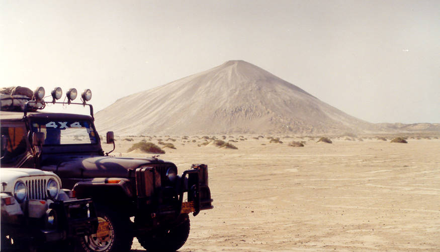

Another picture of the mud volcano. There are two, this is the smaller one.

## Comments (14)

**kashif** - October 27, 2004  4:09 PM

After seeing your pictures, we also make a trip to hingiol last weekend
really it iis a beautiful place

kashif

**Peter Martin-Kaye** - February 24, 2005  1:59 AM

I was stationed at Korangi Creek RAF Flying boat base in 1945 when there was an earthquake off the Mekran coast which resulted in thousands of deaths from the subsequent tidal waves, or tsusami as they would now be called. There were reports from aircraft flying in from the west of volcanic eruptions in Las Bela province, Baluchistan. I didn't believe the volcanic eruption story as the geology wasn't right so I and friend Peter Wolf took leave and, gaining the help of the Wazir of Las Bela who provided a Laissez Passez went on a private expedition to see what had happened. After several days on camel back we arrived at these mud volcanoes Raja Gup, Rana Gup, and Chandra Gup. There were fissures across the desert in the vicinity. It was evident what had occurred. The quake had released a quantity of gas at this interesting place which had ignited in a fiery eruption giving rise to the stories of volcanic eruption.

Peter and I continued to the Hingol river, visting Hinglaj, the Hindu holy place but then, running out of time, hired a fishing boat to take us back to Sonmiani whence we took camels back to the Hab River, and then bus back to Karachi. I still have photographs from this venture.

Not too many strangers ventured across the Hab in those days. Some in Karachi were convinced that we'd be killed by wild animals or tribesmen but in fact we were welcomed by everybody we met, which, outside Sonmiani, was only very few in the desert. The Wazir's Laissez Passer did ensure camels and guides.

Other famous mud volcanes are those of the Arakan Coast. Here it is prudent for travellers to propitiate the spirits that live in them. It is recorded that some foolish person proffered some insult instead and was promptly consumed in a fiery eruption.

best regards

Peter

**aquaris** - April  5, 2005 10:34 PM

A friend of Mine posted... info about the mud volcanos .....infact it was the Peter's article itself....

Peter could you please post your pictures for the benefit of all...

because by your account i thought its some Bubble spirilling Marsh land...but the picture above is that of a mountain......

**aquaris** - April  5, 2005 10:36 PM

Sorry I forget to post the link.....to Peter's re-pulblished article....its at..

<http://www.orkut.com/CommMsgs.aspx?cmm=614392&tid=9968575>

**H.Mandalia** - April 11, 2005  7:40 PM

I am trying to organise a yatra to Hinglaj Temple from Leicester, England. For 20 to 25 people. We have not travel to Hinglaj before, therefore are in need of help in organising such a yatra. Any infromation will be most welcomed.

**Delisle** - April 12, 2005  5:28 PM

Dear Offroaders,
I was made aware by Alan Judd of your web page on Chandragup, which I found very interesting, in particular, because I had visited the place twice and had done some scientific investigations on both Chandragup volcano cones. The mud lake on the 100 m high cone (your picture 11) is about 25 m deep and terminates in a N-S trending fracture, which apparently serves as conduit for the ascending mud. The lower cone, (about 40 m high) with the greenish water in it has a highly variable gas discharge ranging from near zero at times to massive gas discharge with frequent bursts with volumes on the order of close to 1 m³ per second. You will find many more details in the referenced papers below.
I was very intrigued by the comment of Peter Martin-Kaye, whose contribution contains some details I was and probably most of the scientific community is unaware of, in particular his reference to buring fissures close to Chandragup. I would be more than pleased, if you could send me his e-mail address, so I can contact him about this.
We have some plans here in Germany to come back to this site to measure the gas discharge over extended periods of time - but getting funding is hard at this time.
Many thanks

Georg Delisle

References of papers
DELISLE, G., VON RAD, U., ANDRULEIT, H., VON DANIELS, C.H., TABREZ, A.R., .INAM, A. (2002): Active mud volcanoes on- and offshore eastern Makran, Pakistan. – International Journal of Earth Sciences, 91, 93-110.
DELISLE, G. (2005): Mud volcanoes of Pakistan – an overview. – In: Martinelli, G. & Panahi, B. (eds), Mud Volcanoes, Geodynamics and Seismicity, Springer Verlag, 159-169.

**Martin Hovland** - June  9, 2005 12:29 AM

I have previously read all accounts that are available for the Hingol area in Baluchistan - it is really fascinating reading. So one day I will go there myself. One of the good articles available is:
Snead, R.E., 1964. Active mud volcanoes of Baluchistan, West Pakistan. Geographical Review, 4, 546-560.
I have also studied satellite pictures over this region, and also here the large mud volcanoes show up very well. Peter Martin-Kaye's and George Delisle's accounts, above are really informative. It is said that mud volcanoes are more active during low-tide than high tide (moon phases) - does this make sense - I think Dr. Delisle has documented this in Azerbaijan or in baluchistan.
Thanks, Martin Hovland

**MUZAMMIL SIRAJ** - June 18, 2005  2:19 PM

Your achivement is great , we got information about mud volcanoes in hingol & also see pics on your web site and now we are also want to have a trip there,

let our relation grow stronger for dicover & see the new places

Allah hafiz

rgds

Muzammil Siraj Khan

**IKRAM PASHA** - November 11, 2005 12:04 AM

Dear Bloggers,
It is very unfortunate that few details about the Tsunami of 1945 in Makran area is available,I am delighted to read the adventures of Mr. Peter and I request him and any body having fruitful information about that disaster to present and post on the web so we the people and the authrorities in Pakistan may prepare if such event happens again.Best regards to all specially to MR. Peter

**Rahul** - December  8, 2005 12:25 PM

Hello all...i m form Karachi Pakistan..Its Chandragup In Balouchistan....or mein yahan ja chuka hun jo pehle tha ab woh nahee raha pehle log kheteey they ke jo is yatra pai jata tha woh apna KAFAN le kar saath jata tha lekin ab woh nahee raha aab sab jateen hain or ab har cheez ki wahan saholat hain....wahan ke HINGLAJ SEVA SAMAJ ke log sab wahan ki har cheez ki saholat hoti hain...Mein Swami Narayan Temple M.a.jinnah Road Opp Head K.m.c Office Karachi Pakistan Mein Rehta hoon.....if u want to get 2003 picz of HINGOL i will give it to u contact me on RAHUL_HIRALAL@HOTMAIL.COM..........i have more pic of hingol...wahan pai bohut sarrii INTERESTING places hain...i have picz each of them...in hingol there are KALI KHUND,HINGLAG KHUND,BURMA KHUND,RAMA KHUND,ANIL KHUND,TIL KHUND,AGOR NADI,KHARI NADI,SABARI MATA HOME,SHRI RAM SITA LAXMAN BATAKA,GANESHA and much more...

REGARDS

JAI MATA DI....

**vivek sen** - April 17, 2006  3:51 PM

Dear Rahulji,
Apke comment ke lie dahnyabad karta hon. kripa kar aapki li hui tasveerey mujhe e-mail ke zarie bejenge? bari meherbani hogi. Main aapki tasveeron ke zarie Shri Hinglaj Mata ke darshan pana chahta hoon. Namaste.
Vivek Sen Delhi, India.
viveksen53@yahoo.com

**Kanti Kothari** - April 12, 2008  8:49 AM

Dear Mr. Rahul:
I accidentally bumped into this site and it took me to my childhood “ the Bygone time”
I was 15 years old when I went to Mata Hinglaj pilgrimage with 10 adults and 6 youth. Some of the youth are still scattered throughout the world and most adults are in heaven.
Our pilgrimage started from the Swaminarayan Temple where I was born and grew up until I migrated to USA. Our tour we stayed in Lasbela at Mukhi’s home and continued our journey till the river near the deep mountain & jungle about 14 to twenty miles before main Temple. The young people walked and camels carried older people along with our food and supplies. We had one Baluchi Muslim guide from that area with one little 22 point rivolver gun. During our 15 days journey we encountered two loots in small villages in our way by tribes name Bhugtis and Mingals were the looters. We also climbed the mud volcano and did Shiva prayer and collected lots of crystal pieces. Valcano was bubbling lava very slowly and Hindu priest who was with us believed the big bubble as Shiva Lingam coming out of Volcano’s Mouth, what a Myth but it was worth it. I don’t know the name of the priest but he was a priest from Sitla Mata Temple in Nanakwada, Karachi.
Anyways, to the point this area has lots of history from the prehistoric time. Many Devas, Rushis, Munis and Kings Ashoka, Chadra Gupta, Maurya have paid homage to Holly Places. Bhagwan Ramachandra in his Purna Janma as Swaran brought his blind parents for pigrimage and mythological history they believe that Raja Dasrath Killed Swaran at the pond near the mountains before Hinglaj Mata Temple. Hinglaj Mata temple has same significance as other pilgrimage in India. This area has been mostly abducted and looted by the Syrian Sultan Mohamed bin-Kassim in 712 A.D. He invaded and killed innocent people of Indus Valley and kidnapped two daughters of Raja Dhahir Damascus and tied to the horses and ran them thru the arena because they did not want to convert, this fact is taken from the book “Kal Bhoj” written by A Gujrati socialist writer Mr. Ramanlal Vasantlal Desai. The proof of destruction can be found by looking at the Fort of Raja Dhahir in Hyderabad Sindh and 100 thousand graves in MakliThatta, Sindh. India has been nibbled and looted; it is my wish to visit for Darshana of Mata Hinglaj some day. My apologies to everyone on this board if my writing offend in anyway, I am just sharing the information.

Thank you for a wonderful post.

Best Regards to Everyone on this Board

**shaikh Jabir** - June 26, 2008  5:31 PM

chandar gup or raja gup is a marvellous mud volcano,
needed to explore and find realities associated to the religios myths to this volcano.

**Syed Hasan shahid Bukhari** - May  1, 2009  1:42 PM

I am an E-researcher, presently engaged in researching Kirthar Mountains, vis a vis Gorakh Hill Station, and related matters.
In my study of the region's anthropolgy, I discovered that there is this Temple of Kali... called Sri Mata Hinglaj, visited by Hindus of Pakistan and Bharat, just as some Pakistani Muslims visit the Mazaars of Khwaja Moinuddin Chishti at Ajmer or other Muslim saints, buried in what is now, Bharat.

And though during my Shikaar days, in the 70s, 80s and 90s, I often Hunted in Hingol/Mud Volcanoes Region of Lasbela, I could never visit Kali's Temple at Hinglaj. Now that the outing days are past, my research, however, continues on the WWNet. I now visit the Web Sites, relating places I could not then visit, like Hinglaj Temple, See Pictures and read Comments of Hindu Yatris.

It does not surprise me, for I understand the mentality of the still Akhund Bharitias, the Yatris, saying that Government of Pakistan's Visa Authorities, refuse to acknowledge, that there is any such place as Hinglaj, in Pakistan, that the Hindus are being illtreated, and a lot of Political this and that. Because, e.g if I just wrote Moinuddin Chishti, on my application for a visit to Ajmer, I will get a similar reply.

But what I see very interesting, is BBC's promoting of the Akhund Bharat Idea, with Audio and Visual supports, to these Hindu Idealists on the web sites... frankly, it is none of their business. I know old habits die hard, but I ask these idealists, to return to the realities of the 21st Century, and stop black-labeling Pakistan.

Syed Hasan shahid Bukhari
1st of May, 2009

