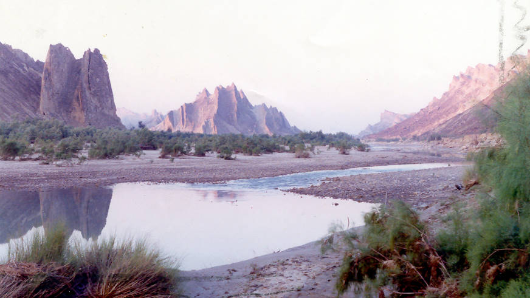

A view of the river along the campsite.

## Comments (5)

**Afraz** - November  1, 2004  1:03 AM

Assalme elikum wwkatoh

OMG u THEY SHOULD HAVE SHOT LORD OF TEH RINGS HERE WHAT A BEAUTIFUL PLACE ESPECIALLY MOUNT DOOM IN DE BACK GROUND REALLY NICE.................

---

**nadeem** - July 24, 2005  2:05 PM

may i know the address of this location ?

---

**KO** - July 24, 2005  2:48 PM

This place is now just off the gwadar coastal highway crosses this place. Keep driving till you get to Hingol - you can't miss it.

---

**Imran yousaf** - September 26, 2005  5:06 PM

hello
I never seen such place but i like it...soo after watching the sites of mountans and lake i want to vivst such places i am much imperessed by such beauty bye Allah hafiz

---

**moiz** - January 19, 2006  6:17 AM

all i can say is wow ... and that i dont the trust the indians....

---

