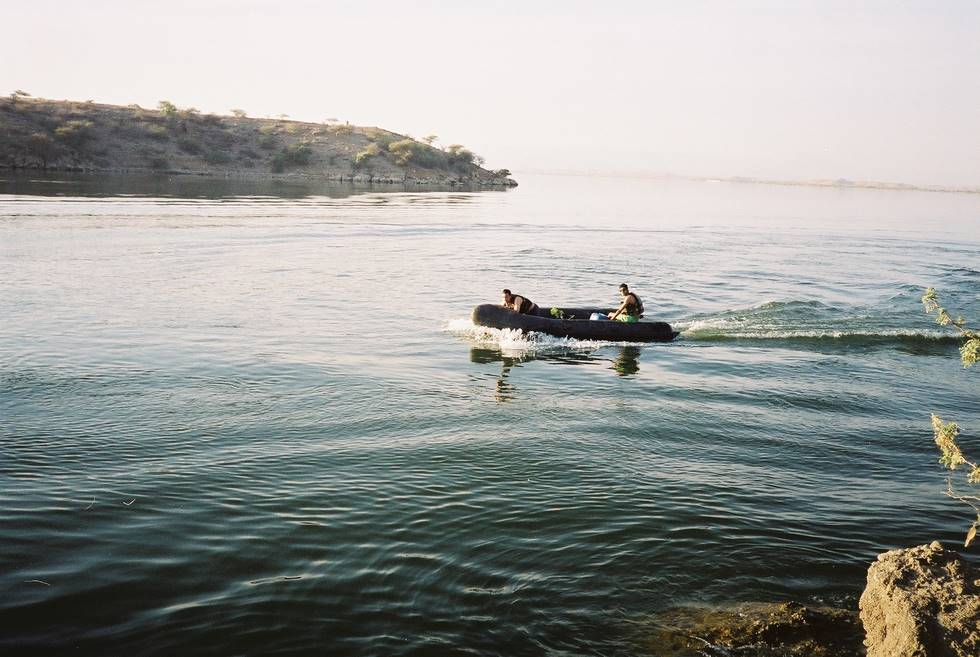

The Zodiac been taken for a test run before Shikar.

## Comments (1)

**datzburier** - April  3, 2005  5:51 AM

I wonder if its allowed to take an inflate-able boat into Rawal Dam in Islamabad, without any permits. In Hingols it seems like no permits would be asked for. It seems like fun. Specially when you use powered propellers. I have not seen anyone do this adventure in Islamabad area. Probably, too diplomatic type. I used to live in ISB, Now I live in Michigan, US. Used to have an economic inflate-able boat myself, here years ago, its alot of fun, untill you tread in water with shrubs, and whatever else beneath, for the fear of boat being punctured. A life jacket would be helpful in that case.

---

