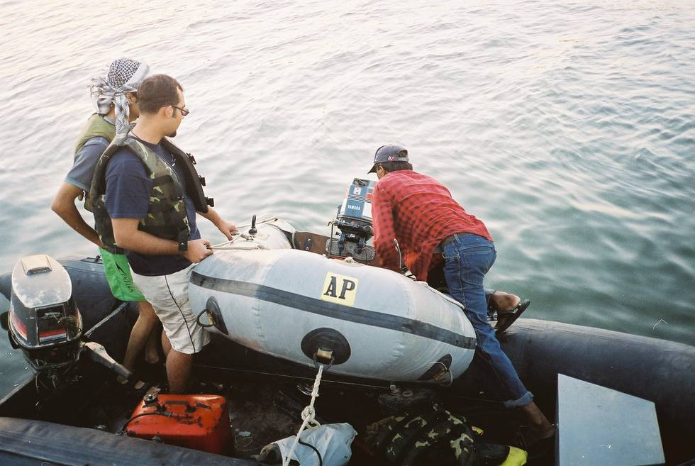

Theres a boat in the water, and another one just above.

## Comments (1)

**KAMRAN SAMAD BALOCH** - October 10, 2004  1:52 PM

I AM EX-CADET KAMRAN SAMAD BALOCH OF CADET COLLEGE PETARO(JAMSHORO).I LIKE TOURISM AND SPEACIALLY THE TOURING PLACES OF BALOCHISTAN.I ALSO HAVE A TOURIST GROUP NAMED "COMPANY". OUR GROUP VISITED NUMBER OF LOCATIONS i.e HINGOL, MAI HINGLAJ MANDER,HUB DAM,SHAH NOORANI,BUMBUL,ZYZRI AND ZIARAT REGION IN BALOCHISTAN.BUT OUR MAIN PROBLEM IS THAT OUR MEMBERS ARE CANT ABLE TO SPEND MUCH MONEY ON THESE TOURS BECAUSE THEY ARE POVER PERSONS.
YOUR GROUP'S WEB SITE IS A GOOD SOURCE OF KNOWLDGE FOR US AND WE PRAY FOR YOUR SUCCESS i.e MAY ALLAH HELPS YOU TO ACHIEVE YOUR GOALS.
THANK YOU

KAMRAN SAMAD BALOCH
COMPANY GROUP

