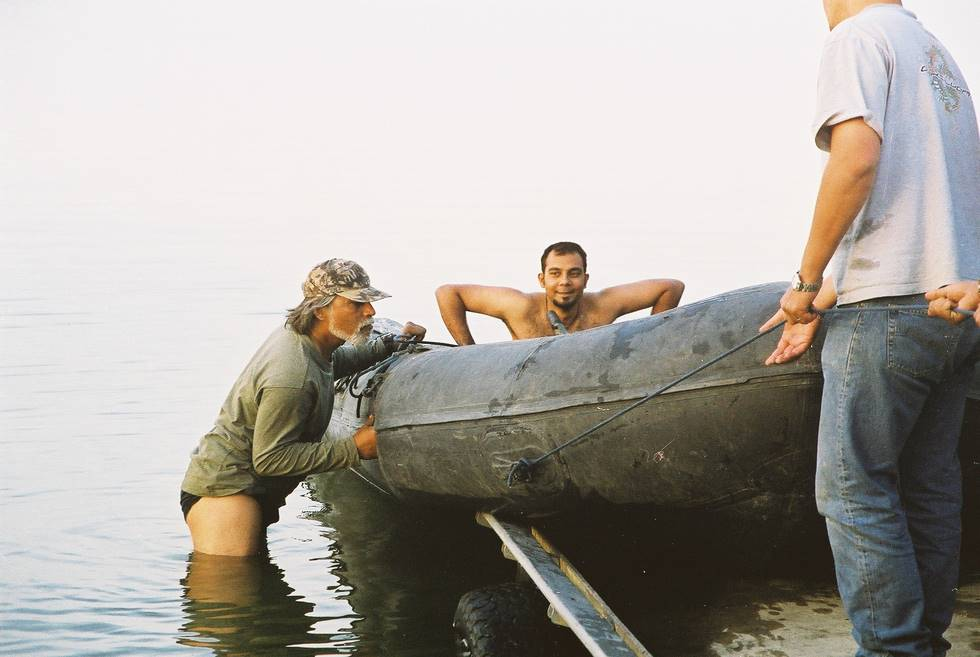

Pic says it all.

## Comments (3)

**Commenter** - October 26, 2005  6:53 AM

By the looks of the chaddee, the water *must* be cold!

---

**Mohammad Khan** - January 13, 2006  4:13 PM

Hi
Excellent website, I have often looked at places on the map and thought, what does this area look like, and thanks to your travel pics got to find out about a few places.
Incidently, were you aware that there are supposed to be mugger crocodiles in the Hub dam and swimming was not advisable there in the past!

---

**KO** - January 16, 2006  1:39 PM

The crocodiles are still supposedly there, but there aren't many left now.

---

