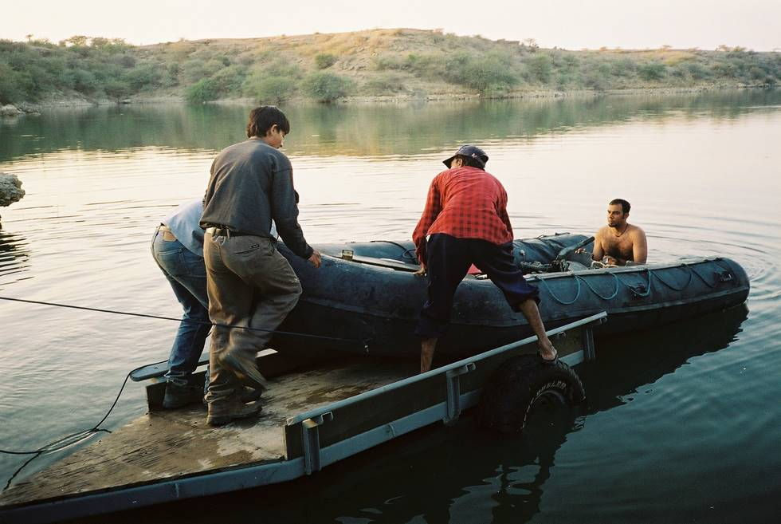

This was not as easy as it looks. The boat weighs a ton, and had two engines in it. It took us an hour to get it loaded. We couldn't take the trailer further back into the water as the jeep would have gotten stuck.

## Comments (1)

**Dumitru** - April 28, 2012  4:04 PM

Doc, here's a money-making idea for you. Being a dermatologist, why not get totehger with a chemist and come up with a face cream or line of skin products using mostly Jamaican plant-based ingredients. There is a treasure trove of material right there in the countryside that your grandparents used to use to bathe, take care of hair etc. It is just to identify, extract the ingredients and bottle/jar it in an attractive package and give it a nice name. Serously, do the research and see if it's doable.

---

