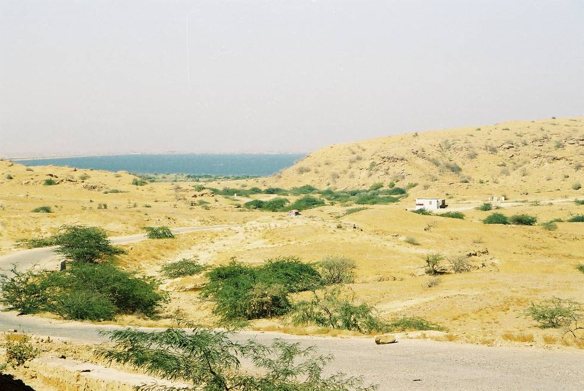

A view of the lake from the road.

## Comments (10)

**Abdurrahman Squires** - February 18, 2005  4:31 AM

That's got to be the best dam picture that I've ever seen!

---

**Asrar** - April 24, 2005 11:08 AM

I was always curious of exploraring Hub Dam but never got a chance to visit it when I was in Karachi. On a spring sunday in London I just typed hub dam on a serach engine and found these wonderful pictures!.

---

**Naveed Zafar** - November 27, 2005 10:51 PM

Another great Piece of Art, and defenitly an excellent view of Pakistan's beauty.

---

**zubair hamid** - April 23, 2008 11:29 PM

you should to show some more picture
i have seen little view of hub dam
It is a natural reservior which is covered by three sides and only one side is made artifitialy.

---

**shameem uddin Ghori** - July 27, 2008  9:30 AM

All is there but where is the dam,where is the spillway,why there is no photo of any wild life of the dam..no fish or fisherman is included. staff,guards,security, enterance are not included. you have provided good looks of the dam but the points I pointed out may be considered in future.thanks.

---

**Baan Maadil** - July 27, 2008  4:26 PM

Ghori,

This is a travel website, not an online resource for terrorists and saboteurs, that they shd put up pics of entrances, spillways and security. There is ample security at the dam, and the guards at the Dam will look well after you. There is a government rest house there up on a hill for people who have forgotten their way. They are well looked after until they have found their way. The ones that leave prematurely add to the biodiversity of the aquatic life in the dam. Hope this helps.

---

**shameem uddin Ghori** - July 29, 2008 10:50 PM

thanky you for telling me all that was ot known to me.

---

**fareed** - November 13, 2008  3:09 PM

yar hunting is allow or not...? or require any permit....
plz telll me

---

**Muhammad Ahsan ul haq** - May 21, 2010 12:51 PM

nice picture, one can easily visulise Hub Dam and its out skrits. a wounder full area to be develop for recreational activity.

---

**Rameez** - June 23, 2011 10:59 AM

Fareed sb! its a game reserve and hunting is prohibited their. I believe Wild life department must issue limited permits for hunting in the century because over population is also not healthy. However, our bad luck "permit say ziada sources ki zaroorat hai"

---

